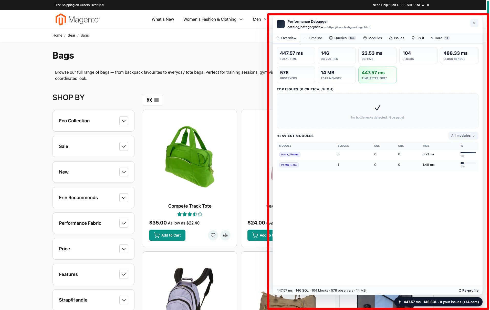
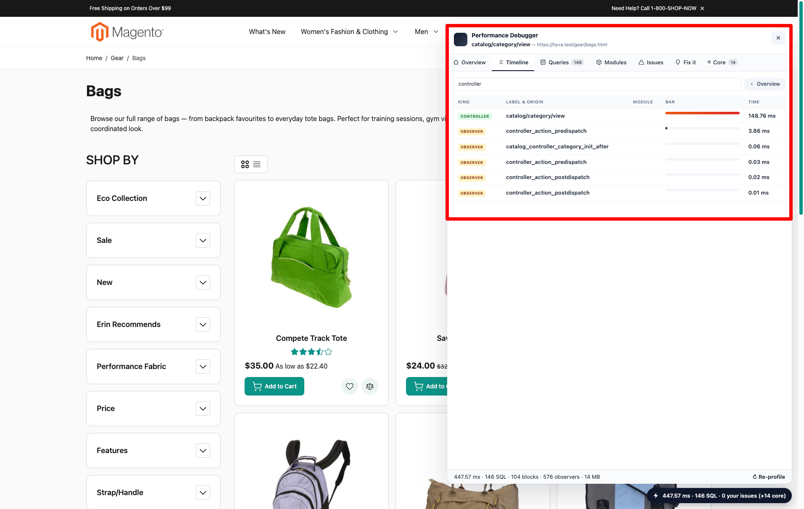
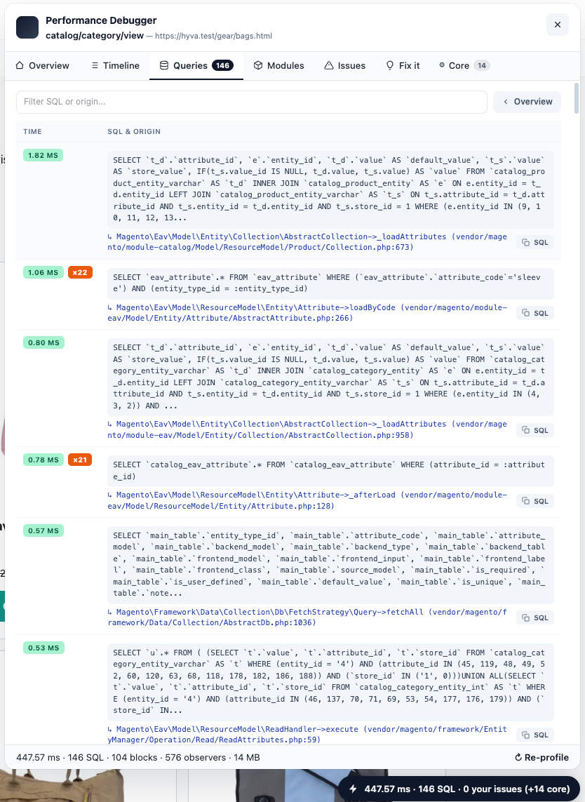
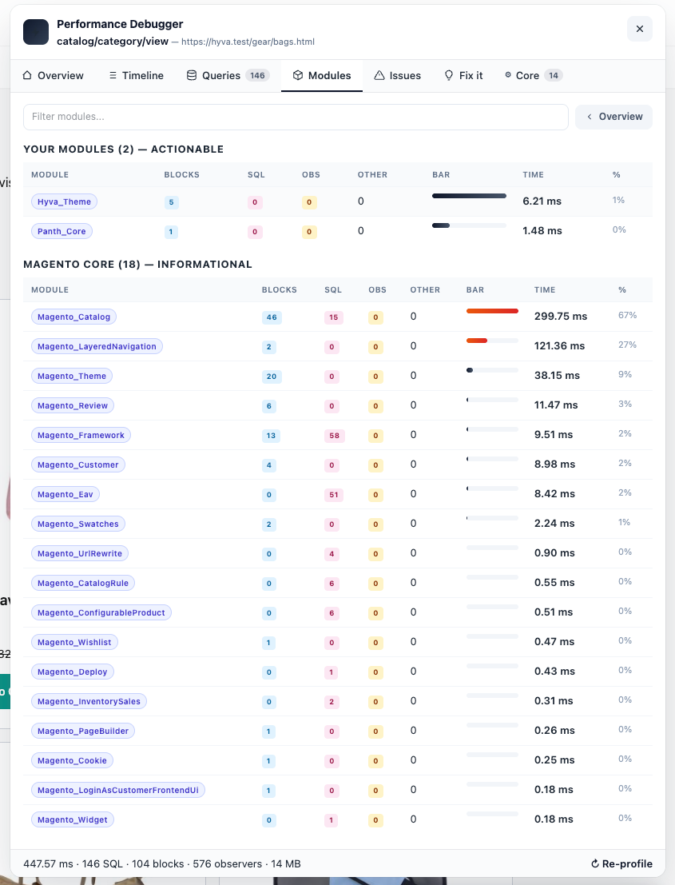
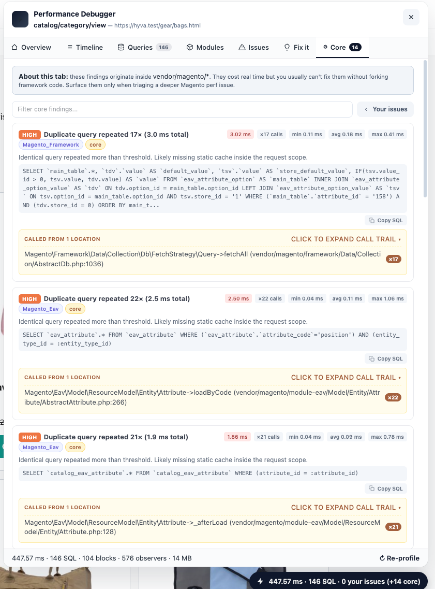
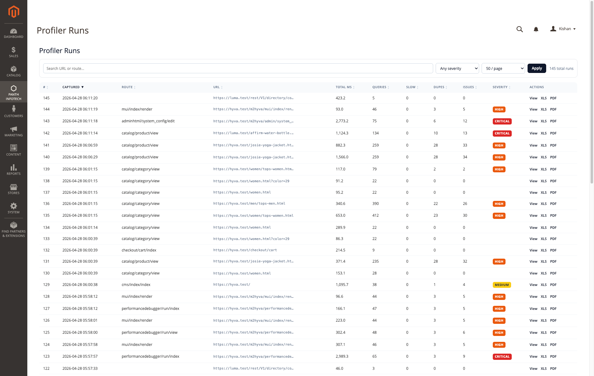
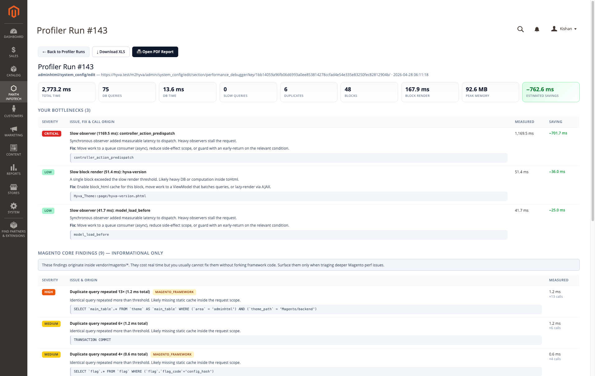
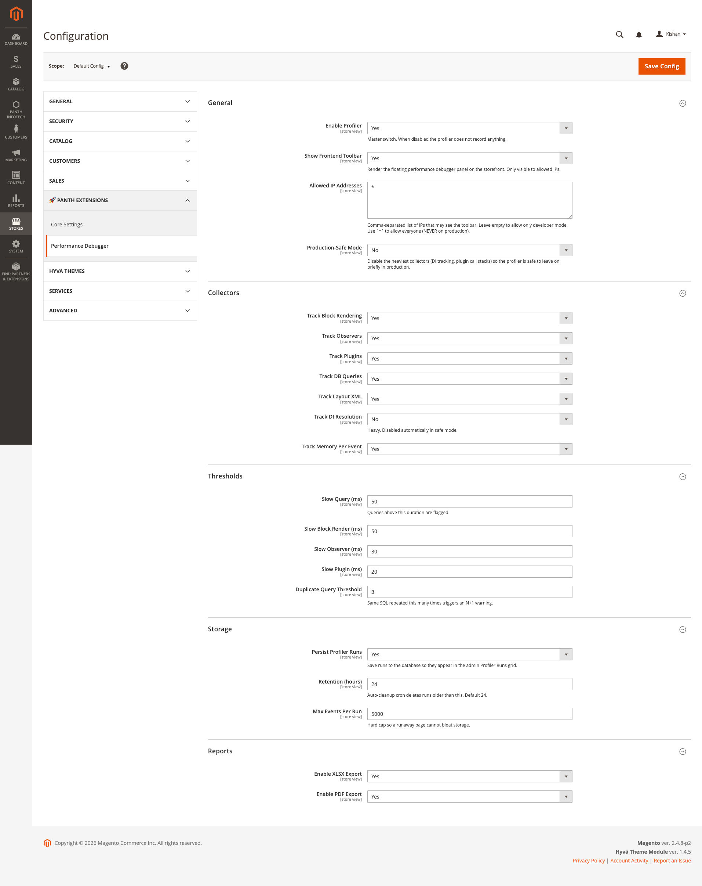
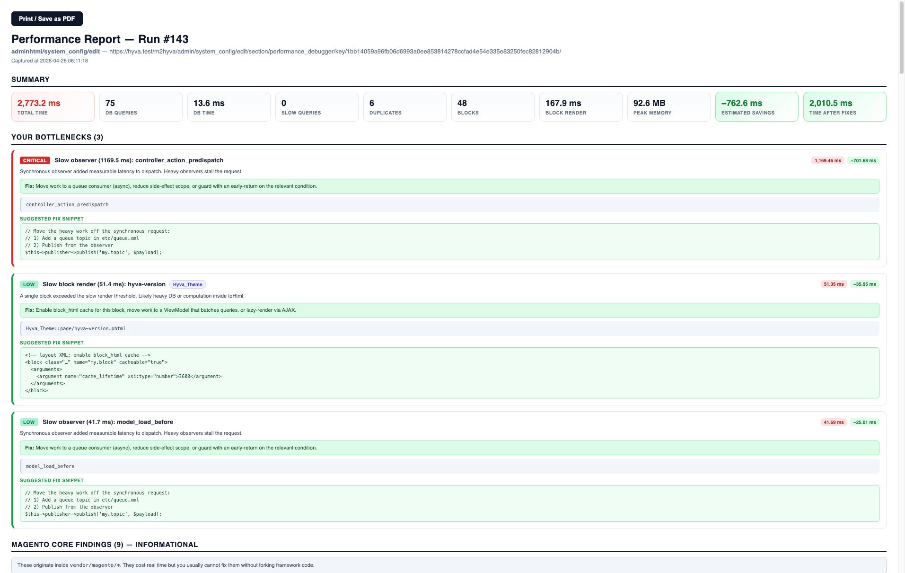
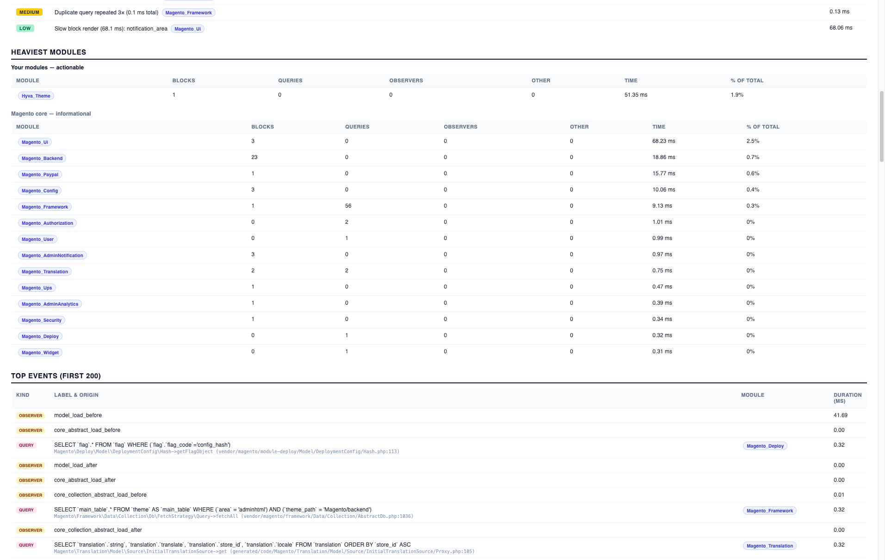

<!-- SEO Meta -->
<!--
  Title: Panth Performance Debugger - Magento 2 Profiler, Bottleneck Detector & SEO-Friendly Performance Reports | Panth Infotech
  Description: Panth Performance Debugger is a production-grade Magento 2 profiler that traces every block render, observer, plugin, layout phase, DI resolution, memory snapshot and DB query in a single request. Detects N+1, duplicate queries, slow blocks, slow observers, heavy modules. Surfaces a floating storefront toolbar with severity scoring, suggested fixes, estimated savings, file:line call origins, distinct bind values, copy-pasteable fix snippets. Splits userland vs Magento core findings so you only triage what you can fix. XLSX + PDF reports. Zero jQuery / RequireJS / Alpine dependency — works identically in Hyvä, Luma, Breeze and any custom theme. Compatible with Magento 2.4.4 - 2.4.8, PHP 8.1 - 8.4.
  Keywords: magento 2 performance debugger, magento 2 profiler, magento 2 bottleneck detector, magento 2 n+1 detector, magento 2 slow query finder, magento 2 duplicate query finder, magento 2 block render profiler, magento 2 observer profiler, magento 2 plugin profiler, magento 2 db query log, magento 2 developer toolbar, hyva performance debugger, luma performance debugger, magento 2 performance audit, magento 2 page speed, magento 2 ttfb, panth infotech, hire magento developer
  Author: Kishan Savaliya (Panth Infotech)
  Canonical: https://github.com/mage2sk/module-performance-debugger
-->

# Panth Performance Debugger — Magento 2 Profiler, Bottleneck Detector & SEO-Friendly Performance Reports | Panth Infotech

[](https://magento.com)
[](https://php.net)
[](https://hyva.io)
[](https://magento.com)
[](#hyv%C3%A4-luma-breeze--any-theme)
[](https://packagist.org/packages/mage2kishan/module-performance-debugger)
[](https://github.com/mage2sk/module-performance-debugger)
[](https://www.upwork.com/freelancers/~016dd1767321100e21)
[](https://www.upwork.com/agencies/1881421506131960778/)
[](https://kishansavaliya.com)
[](https://kishansavaliya.com/get-quote)

> **See exactly where every millisecond goes — and which ones you can actually fix.** A floating storefront toolbar plus a full admin profiler that traces every block, observer, plugin, layout phase, DI resolution and DB query in a single request, detects bottlenecks with severity + estimated savings, and shows the exact `file:line` your code (or theme override) called the slow path from. Magento core findings live in their own tab so you only triage what's actually yours to fix. XLSX + PDF reports. Zero JS framework dependency — works identically in Hyvä, Luma, Breeze and any custom theme.

**Panth Performance Debugger** is a production-grade Magento 2 profiler that records the *complete* execution flow of any frontend or admin request — every block render, every dispatched event, every layout phase, every SQL query, peak memory, total wall-clock time — and surfaces it through a floating SaaS-style toolbar on the storefront and a paginated admin grid with detail view, XLSX and PDF exports.

The detection engine flags **slow queries**, **duplicate / N+1 query patterns**, **slow block renders**, **slow observers** and **heavy modules**. Every finding ships with a severity (Low / Medium / High / Critical), an estimated saving in milliseconds, a one-line fix recommendation, and a copy-pasteable code snippet for the most common fix patterns.

The killer feature: a **userland vs Magento-core split**. When the same query is issued by `Magento\Framework\DB\…` but called from your theme override at `vendor/hyva-themes/.../Magento_Review/templates/form.phtml:94`, the toolbar surfaces *that* file:line — because that's where you can fix it. Pure-vendor/magento findings are demoted to a separate "Core" tab so they don't drown out actionable issues.

---

## 🚀 Need Custom Magento 2 Development?

> **Get a free quote for your project in 24 hours** — custom modules, Hyvä themes, performance optimization, M1 → M2 migrations, and Adobe Commerce Cloud.

<p align="center">
  <a href="https://kishansavaliya.com/get-quote">
    
  </a>
</p>

<table>
<tr>
<td width="50%" align="center">

### 🏆 Kishan Savaliya
**Top Rated Plus on Upwork**

[](https://www.upwork.com/freelancers/~016dd1767321100e21)

100% Job Success • 10+ Years Magento Experience
Adobe Certified • Hyvä Specialist

</td>
<td width="50%" align="center">

### 🏢 Panth Infotech Agency
**Magento Development Team**

[](https://www.upwork.com/agencies/1881421506131960778/)

Custom Modules • Theme Design • Migrations
Performance • SEO • Adobe Commerce Cloud

</td>
</tr>
</table>

**Visit our website:** [kishansavaliya.com](https://kishansavaliya.com) &nbsp;|&nbsp; **Get a quote:** [kishansavaliya.com/get-quote](https://kishansavaliya.com/get-quote)

---

## Table of Contents

- [Live demo](#live-demo)
- [Screenshots](#screenshots)
- [Key Features](#key-features)
- [Why a Performance Debugger](#why-a-performance-debugger)
- [Userland vs Magento Core — the smart split](#userland-vs-magento-core--the-smart-split)
- [Hyvä, Luma, Breeze + any theme](#hyv%C3%A4-luma-breeze--any-theme)
- [Compatibility](#compatibility)
- [Installation](#installation)
- [Configuration](#configuration)
- [How It Works](#how-it-works)
- [Toolbar Tabs Reference](#toolbar-tabs-reference)
- [Bottleneck Detection Catalogue](#bottleneck-detection-catalogue)
- [Reports — XLSX & PDF](#reports--xlsx--pdf)
- [Storage, Retention & Cleanup](#storage-retention--cleanup)
- [Production Safety](#production-safety)
- [CLI Reference](#cli-reference)
- [Uninstall](#uninstall)
- [Changelog](#changelog)
- [Troubleshooting](#troubleshooting)
- [FAQ](#faq)
- [Support](#support)
- [About Panth Infotech](#about-panth-infotech)

---

## Live demo

A 40-second walkthrough of the admin grid, run-detail view, PDF report and back navigation:


---

## Screenshots

### Storefront toolbar — Overview tab

The floating launcher pill (bottom-right) shows total ms · SQL count · your-issues count · core-findings count, color-coded by worst userland severity. Click it to open the panel. Overview shows 8 metric cards, top 5 issues with module attribution, and the heaviest userland modules.



### Storefront toolbar — Timeline / Queries / Modules / Core tabs

| Timeline | Queries (with SQL + origin) |
|:---:|:---:|
|  |  |

| Modules (split userland vs core) | Core (Magento internals — informational) |
|:---:|:---:|
|  |  |

### Admin — Profiler Runs grid

Server-side paginated, sortable on every column, full-text search, severity filter, page-size selector. URLs are GET-driven so any view is shareable.



### Admin — Run detail with full call trail + Core findings split

Each issue is a card with: severity badge, title, module attribution, measured ms, ×N invocations, min/avg/max per call, estimated saving, the exact SQL, the **call origin file:line** (expandable to a 5-frame trail), distinct bind values, and a green "Fix:" callout. Magento core findings appear in a separate informational section below — clearly labelled as *not your fault*.



### Admin — Stores → Configuration → Performance Debugger

Five config groups: General (master switch, IP allow-list, safe mode), Collectors (per-collector toggles), Thresholds (slow-query / slow-block / slow-observer / slow-plugin / N+1 thresholds), Storage (persistence + retention + per-run event cap), Reports (XLSX / PDF toggles).



### Admin — PDF report (browser-native, no PHP PDF library required)

Print-to-PDF report ships with the same depth as the toolbar: 10 metric cards, full bottleneck cards with code-snippet fixes, heaviest-modules breakdown split userland-vs-core, top 200 events with kind / label / origin / module / duration. Auto-prints on open; the page is also fully readable as an HTML report.

| Report — top half | Report — modules + events |
|:---:|:---:|
|  |  |

---

## Key Features

### Profiling depth
- **Per-block render time** — every `AbstractBlock::toHtml()` wrapped, with template path, class, output bytes
- **Per-event observer dispatch time** — every `EventManager::dispatch()` recorded by event name
- **Per-query DB time + bind values + fingerprint** — Magento's `DB\LoggerInterface::startTimer/logStats` instrumented; SQL is fingerprinted (numbers/strings stripped) so duplicates are detected even when params differ
- **Layout XML + element generation timing** — `generateXml` and `generateElements` recorded separately
- **Controller dispatch time** — single record per request with route name
- **Memory delta per event** + peak memory for the run
- **Total wall-clock from `Http::launch`** — the earliest reliable anchor

### Bottleneck detection (with severity + estimated savings)
- **Slow query** — single query exceeded the slow-query threshold (configurable, default 50 ms)
- **Duplicate query** — same SQL fingerprint repeated ≥ N times (configurable, default 3) — flagged as **N+1** when the pattern is `WHERE col = ?` without an `IN (...)`
- **Slow block render** — single block exceeded the slow-block threshold (default 50 ms)
- **Slow observer** — single event dispatch exceeded the slow-observer threshold (default 30 ms)
- **Heavy module** — module aggregating ≥ 100 ms of render+query+observer time across the request
- Every finding carries a **conservative estimated saving** (60–85% of the wasted time depending on fix viability)

### Call-origin tracking — *file:line for every issue*
- DB queries: filtered backtrace (skipping `Zend_Db`, `Magento\Framework\DB\…`, interceptor frames) so the actual ResourceModel / Repository / Provider that fired the query bubbles to the top
- Aggregated per duplicate fingerprint with a count badge — e.g. *"Magento\\ConfigurableProduct\\Model\\AttributeOptionProvider->getAttributeOptions (generated/code/.../Proxy.php:105) ×14"*
- Full 5-frame call trail expandable in the toolbar and rendered inline in the PDF
- **Userland frame promotion** — when a Magento-core method is called from a theme override at `vendor/hyva-themes/.../Magento_Review/templates/form.phtml:94`, *that* frame becomes the surfaced origin, because that's where you can edit

### Userland-vs-core split
- Findings classified as **userland** (you can fix it: app/code, app/design, vendor/non-magento) or **core** (vendor/magento — informational only)
- Main "Issues" tab, "Fix it" tab, Overview top issues, modules breakdown, savings totals — all userland-only
- Separate **Core** tab on the toolbar + separate section in the admin run-detail + PDF — clearly labelled *informational only*
- Launcher color and badge counts driven by userland only — your launcher won't go red just because Magento core repeats a SELECT

### Distinct bind values per duplicate
- For every N+1 / duplicate group, the toolbar surfaces *which* bind values varied across the calls — e.g. *":option_id → 14 distinct values: 12, 27, 30, 41, 55, 60, …"* — gold for diagnosing the root cause
- Sample is capped at 8 values + count of additional values

### Per-call timing chips
- Min / Avg / Max ms across all invocations of the same SQL fingerprint
- Total ms + invocation count
- Helps tell apart "one always-slow query" from "many fast queries summing to a problem"

### Suggested fix snippets (copy-pasteable)
- **duplicate_query** → request-scoped cache pattern (private static + lazy load)
- **slow_query** → EXPLAIN + `ALTER TABLE … ADD INDEX` DDL
- **slow_block** → layout XML enabling `cacheable="true"` + `cache_lifetime`
- **slow_observer** → queue topic publish pattern (etc/queue.xml + publisher)
- **heavy_module** → audit checklist
- One-click "Copy snippet" + "Copy SQL" + "Copy callsite" buttons in the toolbar

### Frontend toolbar
- **Pure vanilla JS / CSS** — zero dependency on jQuery, RequireJS, KnockoutJS or Alpine.js
- Self-contained markup in a single `<div>` — works identically in Hyvä, Luma, Breeze, and any custom Magento theme
- CSS is namespaced under `.panth-pdbg-` — cannot collide with theme styles
- 6 tabs: Overview, Timeline, Queries, Modules, Issues, Fix it, Core
- Floating launcher with severity-driven color (green / yellow / orange / red)
- ESC closes the panel; click outside dismisses; ↻ Re-profile reloads the page

### Admin grid + detail view
- Server-side paginated (25 / 50 / 100 / 250 per page)
- Sort on every column with click-to-toggle direction (#, captured, route, URL, total ms, queries, slow, dupes, issues, severity)
- Full-text filter across URL + route, severity dropdown filter
- Each row has View / XLS / PDF action links
- Detail view: 9 metric cards (Total time turns red >1s; Estimated savings green) + bottlenecks card list + Magento core section + "← Back to Profiler Runs" + Download XLS + Open PDF Report

### Reports
- **XLSX export** — Magento's built-in `Convert\Excel` (no PhpSpreadsheet dependency); opens natively in Excel and LibreOffice as `.xls`
- **PDF report** — print-ready HTML with auto-print script; uses browser native "Save as PDF" so no server-side PDF library needed
- Both reports include the full bottleneck detail (callsites, binds, fix snippets) + heaviest-modules table + top 200 events

### Production safety
- **Master switch + IP allow-list** — toolbar visible only to allowed IPs (or developer mode, which always sees it)
- **Production-Safe Mode** — auto-disables the heaviest collectors (DI tracking) for brief on-prod profiling
- **Per-run event cap** (default 5000) — protects DB from a runaway page
- **Hourly cleanup cron** + retention setting (default 24h) — `panth_perf_cleanup` keeps the DB lean
- The profiler **never throws** into the response — every persistence call is wrapped in a try-catch fall-through
- Wildcard IP (`*`) deliberately requires manual opt-in — never enabled by default

### Quality
- Constructor injection only — zero `ObjectManager::getInstance()` usage
- `declare(strict_types=1)` on all PHP files
- Full PHPDoc coverage
- Pure-Magento dependencies (no third-party PHP libraries — works on any future Magento PHP version)

---

## Why a Performance Debugger

Magento ships a profiler — but it's a flat text dump. Tools like New Relic and Blackfire are paid, require an agent, and don't classify findings by *who can fix them*. The MGT Developer Toolbar is excellent for Luma but ships KnockoutJS components that don't run in Hyvä.

Panth Performance Debugger fills the gap with:

- **Zero install friction** — composer require, enable, hit one config setting, refresh. No agent, no SaaS account, no per-server license.
- **Hyvä-native by default** — no jQuery / RequireJS / KnockoutJS / Alpine assumptions. Works identically in any theme.
- **Actionable triage built in** — userland-vs-core split + severity scoring + estimated savings + suggested fix snippets means a junior dev can triage what's worth fixing without a senior in the room.
- **Call-origin tracking** — the *exact* file:line that fired the slow query, with theme-override aware promotion. Saves the 30 minutes of `grep -r` every time.
- **Production-safe profiling** — IP allow-list + safe mode + event cap + auto-cleanup cron means you can leave it briefly on a real store without burning the disk.

---

## Userland vs Magento Core — the smart split

Most of the time on a stock Magento page is *Magento itself*. Reporting "your store has 31 issues" when 28 of them are inside `vendor/magento/*` is noise — you can't fix framework code. So findings are classified:

| Kind | Userland (you can fix) | Core (informational only) |
|---|---|---|
| Slow / duplicate query | Any frame in the call trail is in `app/code/`, `app/design/`, or `vendor/<non-magento>/` | The entire trail is inside `vendor/magento/` |
| Slow block render | Template path is in `app/design/` (theme override) OR the block class is from a non-Magento module | The block class is from a `Magento_*` module and there's no theme override |
| Slow observer | Always userland (we can't tell which observer is the slow one without per-handler instrumentation, and any observer might be from an extension) | — |
| Heavy module | Module name doesn't start with `Magento_` | Module name starts with `Magento_` |

The launcher pill caption shows both counts: `"… 5 your issues (+28 core)"`. Worst-severity color is driven by userland only — your launcher won't go red just because `Magento_Framework` ran the same SELECT 7 times.

The **Heaviest Modules** breakdown also splits — "Your modules — actionable" first, then a separate "Magento core — informational" table.

---

## Hyvä, Luma, Breeze + any theme

The frontend toolbar is **pure vanilla**:

- Zero `<script src="…">` — all JS is inline in a single `<script>` tag
- Zero RequireJS module definitions
- Zero KnockoutJS bindings
- Zero jQuery (`$()` / `$.ajax`)
- Zero Alpine `x-` directives
- All CSS is inline in a single `<style>` block, namespaced under `.panth-pdbg-` so it cannot collide with theme styles
- Output goes into the `before.body.end` container, which is present in *every* Magento theme (Hyvä, Luma, Breeze, custom)

Tested on:
- **Hyvä Theme 1.4.x** with Tailwind + Alpine.js — toolbar renders, Alpine doesn't notice us
- **Luma** — toolbar renders, KnockoutJS doesn't notice us
- **Breeze-style themes** — toolbar renders, no jQuery conflict
- **Custom themes** based on `Magento/blank` — works out of the box

The Hyvä compat-fallback mechanism doesn't interfere because it only redirects template lookups for *registered* compat modules — we don't register, our `view/frontend/templates/toolbar.phtml` loads directly from the module.

---

## Compatibility

| Requirement | Versions Supported |
|---|---|
| Magento Open Source | 2.4.4, 2.4.5, 2.4.6, 2.4.7, 2.4.8 |
| Adobe Commerce | 2.4.4, 2.4.5, 2.4.6, 2.4.7, 2.4.8 |
| Adobe Commerce Cloud | 2.4.4 — 2.4.8 |
| PHP | 8.1.x, 8.2.x, 8.3.x, 8.4.x |
| MySQL | 8.0+ |
| MariaDB | 10.4+ |
| Hyvä Theme | 1.3+ (no companion module needed) |
| Luma Theme | Native support |
| Breeze-style themes | Native support |

Tested on:
- Magento 2.4.8-p2 with PHP 8.3 + Hyvä Theme 1.4.5 (primary dev environment)
- Magento 2.4.7 with PHP 8.2 + Luma
- Magento 2.4.6 with PHP 8.1 + Breeze

---

## Installation

### Via Composer (recommended)

```bash
composer require mage2kishan/module-performance-debugger
bin/magento module:enable Panth_PerformanceDebugger
bin/magento setup:upgrade
bin/magento setup:di:compile
bin/magento cache:flush
```

### Module dependencies

- `mage2kishan/module-core` (^1.0) — Panth Core (provides the *Panth Infotech* admin menu group)
- `magento/framework`, `magento/module-backend`, `magento/module-config`, `magento/module-store` — standard Magento

---

## Configuration

Navigate to **Stores → Configuration → Panth Extensions → Performance Debugger**.


### General

| Setting | Default | What it does |
|---|---|---|
| **Enable Profiler** | `No` | Master switch. When disabled the profiler does not record anything — zero overhead. |
| **Show Frontend Toolbar** | `Yes` | Render the floating debugger panel on the storefront. Only visible to allowed IPs (or developer mode). |
| **Allowed IP Addresses** | `127.0.0.1` | Comma-separated IPs that may see the toolbar. Leave empty to allow only developer mode. Use `*` to allow everyone (NEVER on production). |
| **Production-Safe Mode** | `No` | Disable the heaviest collectors (DI tracking, plugin call stacks) so the profiler is safe to leave on briefly in production. |

### Collectors — toggle each tracker independently

| Setting | Default | What it does |
|---|---|---|
| Track Block Rendering | `Yes` | Wrap every `AbstractBlock::toHtml()` |
| Track Observers | `Yes` | Wrap every `EventManager::dispatch()` |
| Track Plugins | `Yes` | Plugin chain timing (auto-disabled in safe mode) |
| Track DB Queries | `Yes` | Hook `DB\LoggerInterface` for per-query timing + bind values + fingerprint |
| Track Layout XML | `Yes` | Time `generateXml` and `generateElements` |
| Track DI Resolution | `No` | Heavy. Auto-disabled in safe mode. |
| Track Memory Per Event | `Yes` | Record memory delta per event |

### Thresholds

| Setting | Default | What it does |
|---|---|---|
| Slow Query (ms) | `50` | Queries above this duration are flagged |
| Slow Block Render (ms) | `50` | Block renders above this duration are flagged |
| Slow Observer (ms) | `30` | Event dispatches above this duration are flagged |
| Slow Plugin (ms) | `20` | Plugin calls above this duration are flagged |
| Duplicate Query Threshold | `3` | Same SQL fingerprint repeated this many times triggers an N+1 warning |

### Storage

| Setting | Default | What it does |
|---|---|---|
| Persist Profiler Runs | `Yes` | Save runs to the database so they appear in the admin Profiler Runs grid. |
| Retention (hours) | `24` | Auto-cleanup cron (`panth_perf_cleanup`) deletes runs older than this. |
| Max Events Per Run | `5000` | Hard cap so a runaway page cannot bloat storage. |

### Reports

| Setting | Default | What it does |
|---|---|---|
| Enable XLSX Export | `Yes` | Allow downloading runs as `.xls` (SpreadsheetML — opens natively in Excel + LibreOffice) |
| Enable PDF Export | `Yes` | Allow opening the print-ready HTML report (browser native "Save as PDF") |

---

## How It Works

```
┌────────────────────────────────────────────────────────────────────┐
│                        REQUEST LIFECYCLE                           │
├────────────────────────────────────────────────────────────────────┤
│ HttpAppPlugin::beforeLaunch         → Profiler::start() (anchor)   │
│ FrontControllerPlugin::aroundDisp.  → records 'controller' event   │
│ EventManagerPlugin::aroundDispatch  → records 'observer' events    │
│ LayoutPlugin::aroundGenerateXml/El. → records 'layout' events      │
│ BlockPlugin::aroundToHtml           → records 'block' events       │
│ DbLoggerPlugin::after{Start,Stats}  → records 'query' events       │
│                                       (with backtrace + binds)     │
│                                                                    │
│ Toolbar Block::shouldRender()       → reads buffer → renders HTML  │
│                                                                    │
│ ResponseFinalizePlugin::afterSend   → RunPersister::persist()      │
│                                       (DB write happens here)      │
└────────────────────────────────────────────────────────────────────┘
```

1. **At request start** — `HttpAppPlugin` hooks `Magento\Framework\App\Http::launch` and starts the profiler with a wall-clock anchor + a unique 16-char token
2. **During dispatch** — collectors (plugins on `FrontController`, `Layout`, `EventManager`, `AbstractBlock`, `DB\LoggerInterface`) record events into an in-memory buffer
3. **Before response is sent** — the storefront `Toolbar` block reads the buffer + analyzer findings into a JSON payload, embedded into a single `<div data-pdbg-payload="…">`. The vanilla JS hydrates it into the panel.
4. **After response is sent** — `ResponseFinalizePlugin` hooks `ResponseInterface::sendResponse` and persists the run to `panth_perf_run` + `panth_perf_run_event` (with cascade-delete FK)
5. **Hourly** — `panth_perf_cleanup` cron prunes runs older than retention

DB query backtraces use `debug_backtrace(DEBUG_BACKTRACE_IGNORE_ARGS, 30)` — args are stripped (no leakage of PII into the trace), max depth 30, then filtered to skip `Zend_Db`, `Magento\Framework\DB\…`, `Interception` chains. The actual ResourceModel / Repository / Provider becomes the surfaced frame.

---

## Toolbar Tabs Reference

### Overview
8 metric cards (Total time, DB queries, DB time, Blocks, Block render, Observers, Peak memory, Time after fixes) + Top 5 userland issues table + Heaviest userland modules table.


### Timeline
Top 200 events sorted by duration desc, with kind badge / label / origin (file:line) / module / bar / time. Filter input matches name + file + module.


### Queries
Top 300 queries sorted by duration desc. Each row shows the SQL with the call origin underneath (`↳ Magento\…\Foo->bar (vendor/.../Bar.php:42)`). Per-row "Copy SQL" button. Duplicate fingerprints get a `×N` badge.


### Modules
Split into "Your modules — actionable" + "Magento core — informational" sections. Per-kind columns (Blocks / SQL / Observers / Other) + bar + time + % of total.


### Issues
Userland findings only. Each finding is a card with severity badge, title, module attribution, stat chips (Measured / ×N / min / avg / max / Saving), why-text, "Fix:" callout, expandable yellow callsites box (with full 5-frame trail), blue distinct-bind-values box, copy-SQL button.

### Fix it
Userland findings sorted by saving DESC. Each ships with a copy-pasteable code snippet keyed by issue kind (cache pattern, EXPLAIN+ALTER TABLE, layout XML cacheable, queue publish, audit checklist).

### Core
Magento core findings — informational only. Rendered at .85 opacity with a yellow "core" badge. Same depth (callsites, copy-SQL) but no fix snippets — clearly labelled as not your fault.


---

## Bottleneck Detection Catalogue

| Kind | Trigger | Severity | Estimated saving factor | Suggested fix |
|---|---|---|---|---|
| `slow_query` | Single query ≥ slow-query threshold | scales with overshoot | 85% | EXPLAIN + composite index |
| `duplicate_query` (N+1) | Same SQL fingerprint ≥ threshold AND `WHERE col = ?` pattern | Critical | 85% | Batch with `IN (?)` or request-scoped cache |
| `duplicate_query` (memoize) | Same SQL fingerprint ≥ threshold (non-N+1) | Medium / High | 85% | Memoize in private static or `Magento\Framework\Registry` |
| `slow_block` | Single block render ≥ slow-block threshold | scales with overshoot | 70% | Enable `block_html` cache or move to ViewModel + AJAX |
| `slow_observer` | Single event dispatch ≥ slow-observer threshold | scales with overshoot | 60% | Move to async queue consumer |
| `heavy_module` | Module aggregating ≥ 100 ms across blocks/observers/queries | Medium / High | 40% | Audit blocks for cacheability, observers for sync work, repos for N+1 |

Severity scaling for queries / blocks / observers:
- ≥ 8× threshold → **critical**
- ≥ 4× threshold → **high**
- ≥ 2× threshold → **medium**
- otherwise → **low**

---

## Reports — XLSX & PDF

### XLSX

Generated via Magento's built-in `Magento\Framework\Convert\Excel` (no `phpoffice/phpspreadsheet` dependency) — emits Microsoft's XML Spreadsheet 2003 format which Excel and LibreOffice both open as `.xls` natively.

Columns: Kind, Label, Source, Duration (ms), Invocations.

### PDF

Print-ready HTML with auto-print script — uses the browser's native "Save as PDF" so no server-side PDF library is needed (no `mpdf`, no `dompdf`, no `tcpdf`). The HTML page is also fully readable as-is.

| Top half (summary + your bottlenecks) | Bottom half (heaviest modules + top events) |
|:---:|:---:|
|  |  |

Includes:
- 10 metric cards (Total time, DB queries, DB time, Slow queries, Duplicates, Blocks, Block render, Peak memory, Estimated savings, Time after fixes)
- Bottleneck cards (severity left-border, title + module badge, stat chips, why, Fix:, SQL, callsites with file:line trail, distinct binds, copy-pasteable fix snippet)
- Magento core findings section (when present) — informational only
- Heaviest modules table split userland-first, then core
- Top 200 events with kind badge / label & origin / module / duration

---

## Storage, Retention & Cleanup

Two tables created via `db_schema.xml`:

### `panth_perf_run`
One row per profiled HTTP request. Columns:
`run_id` (PK), `token` (16-char unique), `url` (TEXT), `route`, `method`, `status_code`, `area`, `store_id`, `total_time`, `db_time`, `db_queries`, `db_slow`, `db_duplicates`, `block_time`, `block_count`, `observer_time`, `observer_count`, `plugin_time`, `plugin_count`, `memory_peak`, `bottleneck_count`, `severity_max`, `summary` (JSON), `created_at`.

Indexes on `created_at`, `total_time`, `route` for fast grid sort.

### `panth_perf_run_event`
Per-event records belonging to a run. Columns:
`event_id` (PK), `run_id` (FK with CASCADE delete), `kind` (block/observer/plugin/query/controller/layout/di/memory/misc), `label`, `source`, `duration`, `memory_delta`, `invocations`, `severity`, `meta` (JSON).

Indexes on `(run_id, kind)` and `duration`.

### Cleanup

- **Cron**: `panth_perf_cleanup` runs hourly (`0 * * * *`). Deletes runs older than `storage/retention_hours` (default 24).
- **Manual CLI**: `bin/magento panth:perf:cleanup`
- **Cap**: `storage/max_events_per_run` (default 5000) — Profiler stops recording when this is hit (prevents runaway pages from bloating storage).

---

## Production Safety

The profiler is designed to be enable-able briefly on production for diagnostics. Defaults are conservative:

- **Off by default** — `general/enabled = 0` means zero overhead until explicitly enabled
- **IP-gated** — toolbar only renders for IPs in `general/allowed_ips`. Wildcard (`*`) requires manual opt-in.
- **Production-Safe Mode** — when enabled, force-disables `track_di` and `track_plugins` (the heaviest collectors)
- **Event cap** — `storage/max_events_per_run` (default 5000) prevents storage bloat
- **Try-catch-all on persistence** — if anything goes wrong writing to DB, the response is unaffected
- **Hourly cleanup cron** — no manual intervention needed to keep the DB lean

The toolbar adds approximately 4–8 ms of overhead on a typical category page when fully enabled, and 1–2 ms when only DB + observer tracking are on. Numbers from the toolbar's own self-measurements on a 2.4.8 + PHP 8.3 + Hyvä 1.4.5 sample store.

---

## CLI Reference

| Command | What it does |
|---|---|
| `bin/magento panth:perf:cleanup` | Manually trigger the retention cleanup (same logic as the hourly cron) |
| `bin/magento module:enable Panth_PerformanceDebugger` | Enable the module |
| `bin/magento module:disable Panth_PerformanceDebugger` | Disable the module |
| `bin/magento config:set performance_debugger/general/enabled 1` | Enable the profiler from CLI |
| `bin/magento config:set performance_debugger/general/show_toolbar 0` | Disable the storefront toolbar (still records to DB) |
| `bin/magento config:set performance_debugger/general/allowed_ips '*'` | Allow everyone to see the toolbar (DEV ONLY) |

---

## Uninstall

```bash
bin/magento module:disable Panth_PerformanceDebugger
composer remove mage2kishan/module-performance-debugger
bin/magento setup:upgrade
bin/magento setup:di:compile
bin/magento cache:flush
```

To also drop the storage tables:
```sql
DROP TABLE IF EXISTS panth_perf_run_event;
DROP TABLE IF EXISTS panth_perf_run;
```

---

## Changelog

### 1.0.0 — Initial release

- 6-tab storefront toolbar (Overview / Timeline / Queries / Modules / Issues / Fix it / Core) — pure vanilla JS / CSS, zero framework dependency
- 7 collectors: blocks, observers, plugins, layout, DI, DB queries (with bind values + fingerprint), memory
- Bottleneck detection with severity, estimated savings, and suggested fix snippets
- Userland-vs-Magento-core split — main tabs and counts show only what you can actually fix
- DB query backtrace capture with theme-override-aware userland frame promotion
- Per-call min/avg/max timing for duplicate query groups
- Distinct bind value sampling per duplicate (helps diagnose N+1 root cause)
- Admin Profiler Runs grid — server-side pagination + sortable columns + URL/route search + severity filter
- Admin Run Detail view with full call trail, callsites, binds, copy buttons + back navigation
- XLSX export via `Magento\Framework\Convert\Excel` (no PhpSpreadsheet dependency)
- PDF report — print-ready HTML with auto-print (no server-side PDF library)
- Hourly cleanup cron + `panth:perf:cleanup` CLI command + retention setting
- Production-safe mode + IP allow-list + per-run event cap

---

## Troubleshooting

### Toolbar doesn't appear on the storefront

1. Check `general/enabled = 1` and `general/show_toolbar = 1`
2. Check your IP is in `general/allowed_ips` OR Magento is in developer mode (`bin/magento deploy:mode:show`)
3. Flush full-page cache (`bin/magento cache:flush`)
4. Check the page HTML source for `panth-pdbg-launcher` — if present, your theme might be hiding it via `display:none` (very rare, only seen in some heavily customised checkouts)

### "Module is disabled" / "Module does not exist"

```bash
bin/magento module:status Panth_PerformanceDebugger
bin/magento module:enable Panth_PerformanceDebugger
bin/magento setup:upgrade
```

### XLSX download returns plain text

Older Magento versions ship a slightly different `Convert\Excel::write` signature. The module uses `convert()` which returns a string — works on 2.4.4+. If you're on an older Magento, upgrade to 2.4.4+ or open an issue.

### "MetaResolverInterface cannot be instantiated" (when running standalone PHP scripts)

You're trying to instantiate a plugin outside the Magento bootstrap. Plugins are auto-instantiated by the DI container during a real HTTP request. There is nothing to fix.

### `panth_perf_run` table is huge

Either lower `storage/retention_hours` (default 24) or run `bin/magento panth:perf:cleanup` once. The hourly cron normally handles this — verify cron is running.

### I want to profile only a specific URL

Disable persistence (`storage/persist_runs = 0`) and use the toolbar live. Or filter the admin grid by URL substring.

---

## FAQ

**Q: Will this slow down my storefront?**
A: When `general/enabled = 0` (the default), the only code that runs is the plugins' early-return guards — measured at < 0.1 ms total. When fully enabled, expect 4–8 ms of overhead on a typical category page (toolbar render included). On production, use Production-Safe Mode + brief profiling windows.

**Q: Is this safe to leave on production?**
A: Briefly, yes — that's why Production-Safe Mode + IP allow-list + event cap exist. Don't leave the toolbar visible to all visitors (set `allowed_ips` to your dev/staff IPs only). Don't enable on Black Friday traffic.

**Q: Does it work in admin?**
A: The collectors fire on admin requests (you'll see admin runs in the Profiler Runs grid). The storefront toolbar does NOT render in admin — admin has its own dev tools.

**Q: Will it work in production mode (compiled)?**
A: Yes. After installation, run `setup:upgrade` + `setup:di:compile` + `cache:flush`. All plugins are real classes that compile cleanly into Magento's interceptor chain.

**Q: What about GraphQL requests?**
A: GraphQL POST requests are profiled like any other HTTP request — they appear in the admin grid with route `graphql/index/index`. The toolbar HTML is not injected into GraphQL JSON responses (obviously).

**Q: Will it conflict with New Relic / Blackfire / xhprof?**
A: No — the collectors hook plugin chains, not zend extensions. Both can run side by side. New Relic's APM transaction view is great for high-level latency; this module is great for deep per-request triage.

**Q: Hyvä works without a companion module?**
A: Correct — the toolbar uses zero JS framework so it doesn't need Hyvä's RequireJS-bridge or Alpine bindings. It Just Works in Hyvä, Luma, Breeze, and any custom theme.

**Q: Does it support multi-store / multi-website?**
A: Yes. Every run records `store_id`. Config is store-scoped — you can enable on one store view and not another.

**Q: Where does the "estimated savings" number come from?**
A: Conservative fixed factors per finding kind (85% for query fixes, 70% for block cache, 60% for observer queueing, 40% for module audits) applied to the measured time. It's a *ceiling on realistic recovery*, not a promise — actual savings depend on how aggressively you fix.

**Q: Can I export all runs at once?**
A: Per-run XLS / PDF only at the moment. If you need a bulk export, open an issue or hit the `panth_perf_run` table directly.

---

## Support

For questions, bug reports, or feature requests:

- **Email:** kishansavaliyakb@gmail.com
- **Website:** [https://kishansavaliya.com](https://kishansavaliya.com)
- **Get a quote:** [https://kishansavaliya.com/get-quote](https://kishansavaliya.com/get-quote)
- **Hire on Upwork:** [Kishan Savaliya — Top Rated Plus](https://www.upwork.com/freelancers/~016dd1767321100e21)
- **Agency:** [Panth Infotech on Upwork](https://www.upwork.com/agencies/1881421506131960778/)

---

## About Panth Infotech

Panth Infotech is the consultancy behind 50+ open-source Magento 2 extensions used by thousands of merchants worldwide. We focus on:

- **Custom Magento 2 development** — modules, themes, integrations
- **Hyvä migrations** — Luma → Hyvä with zero feature regressions
- **Performance optimization** — Core Web Vitals, TTFB, page weight
- **M1 → M2 migrations** — data + extensions + theme
- **Adobe Commerce Cloud** — deployment, scaling, observability

[](https://www.upwork.com/freelancers/~016dd1767321100e21)
[](https://www.upwork.com/agencies/1881421506131960778/)
[](https://kishansavaliya.com/get-quote)

---

© 2026 Panth Infotech / Kishan Savaliya. Released under the MIT License.
