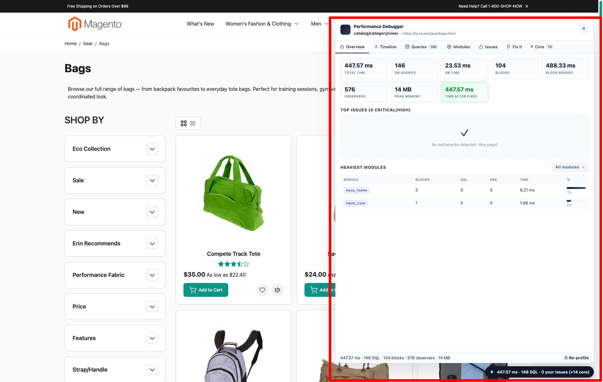
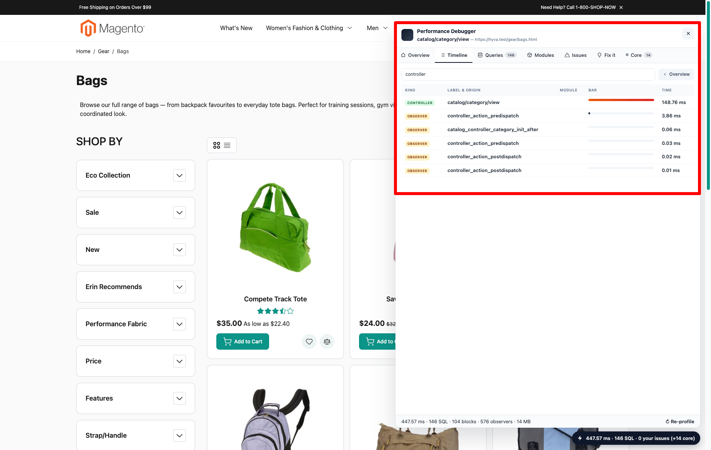
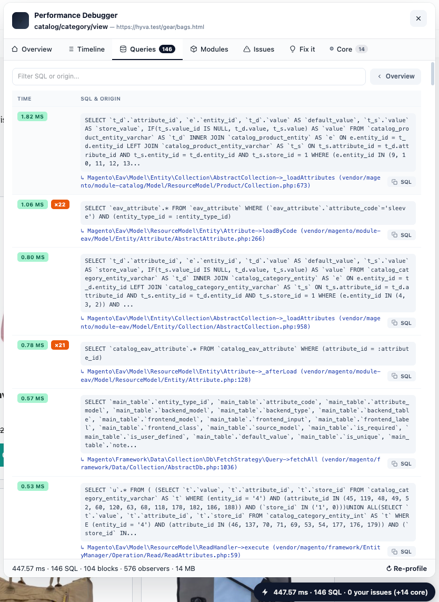
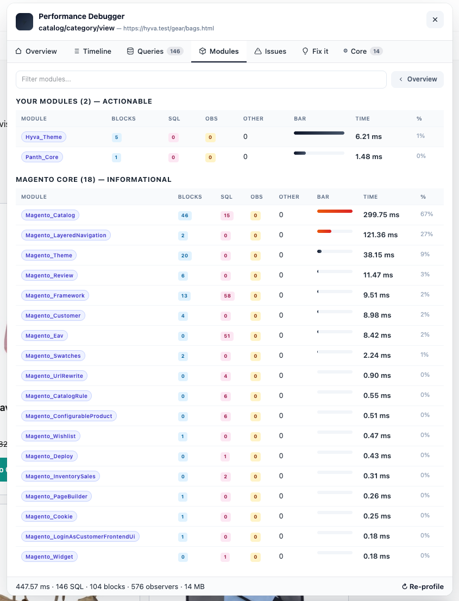
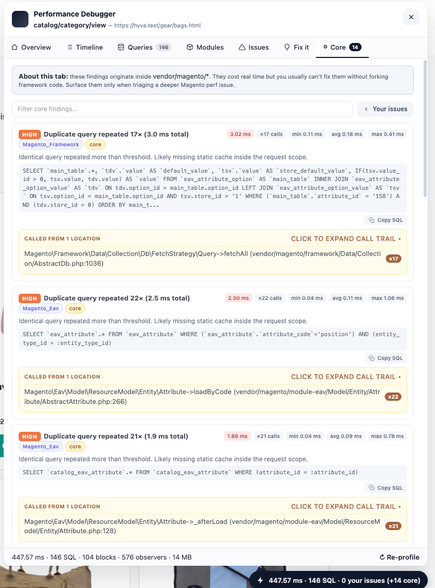
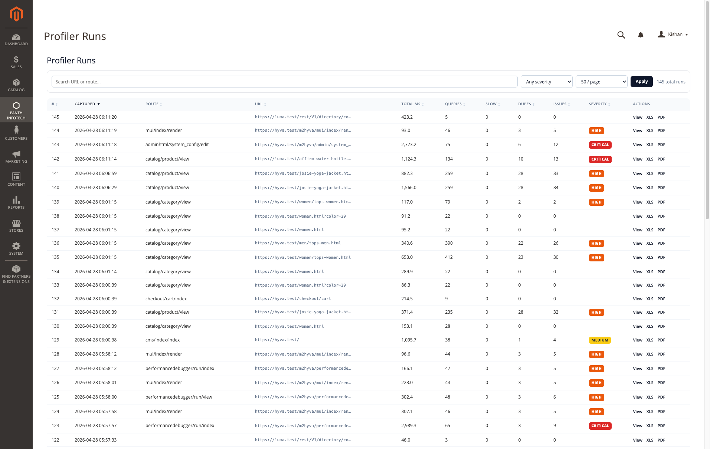
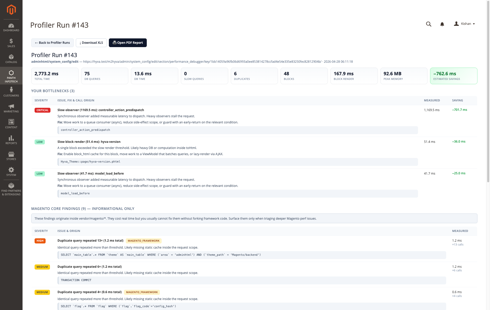
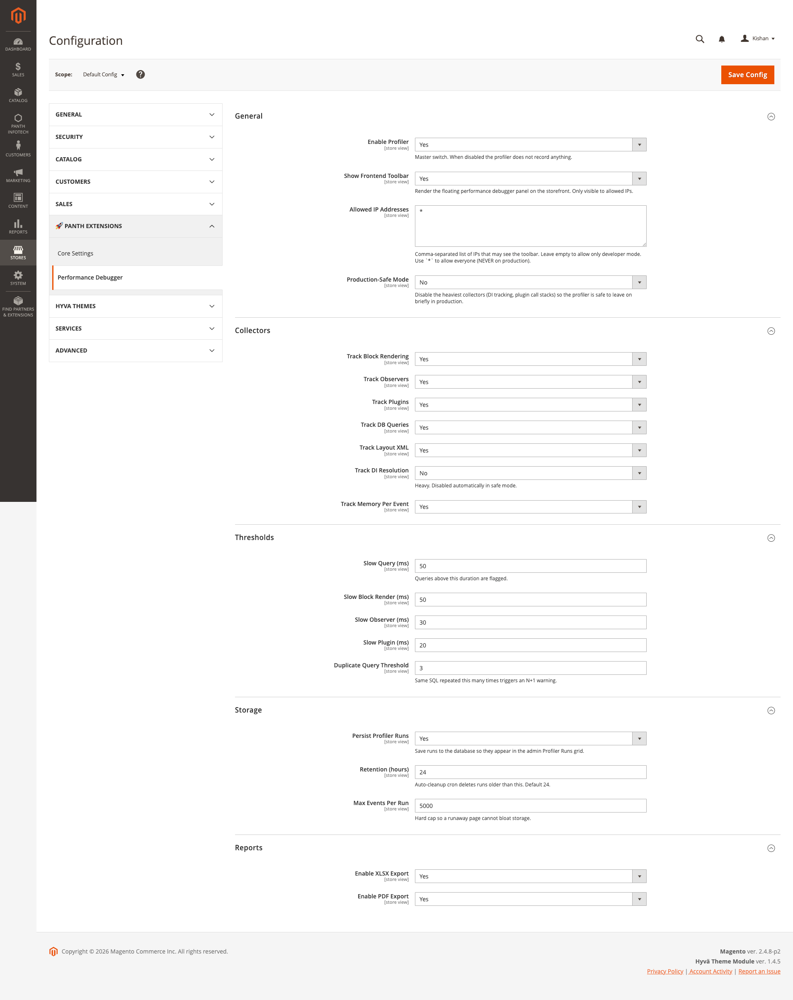
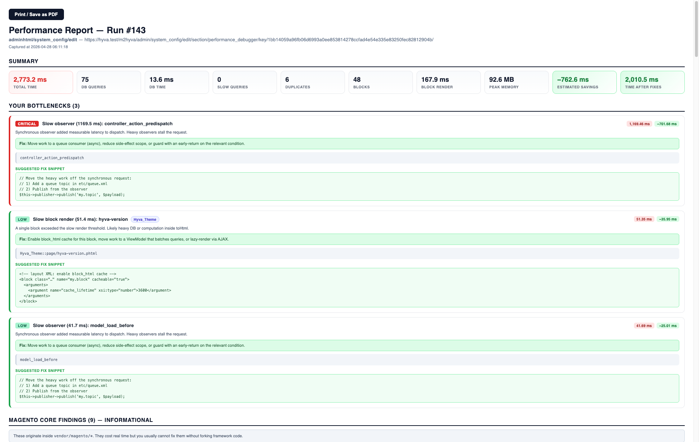
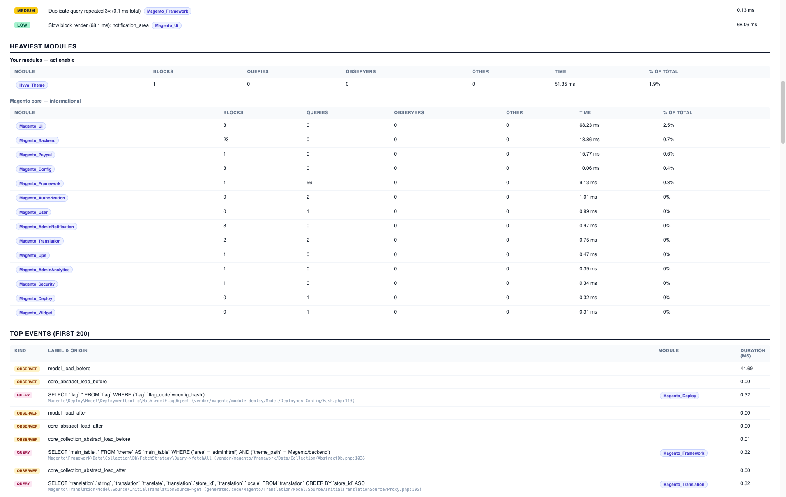

<!-- SEO Meta -->
<!--
  Title: Magento 2 Performance Debugger: Profiler, N+1 Detector & XLSX/PDF Reports | Panth Infotech
  Description: Panth Performance Debugger is a Magento 2 profiler that traces every block render, observer, plugin, layout phase, DB query, and memory snapshot in a single request. Detects slow queries, N+1 patterns, slow blocks, and heavy modules. Shows a floating storefront toolbar with severity scoring, estimated savings, file:line call origins, and copy-pasteable fix snippets. Splits userland vs Magento core findings. XLSX and PDF reports. Zero jQuery / RequireJS / Alpine dependency - works in Hyva, Luma, Breeze, and any custom theme.
  Keywords: magento 2 performance debugger, magento 2 profiler, magento 2 bottleneck detector, magento 2 n+1 detector, magento 2 slow query finder, magento 2 duplicate query finder, magento 2 block render profiler, magento 2 observer profiler, magento 2 plugin profiler, magento 2 db query log, magento 2 developer toolbar, hyva performance debugger, luma performance debugger, magento 2 performance audit, magento 2 page speed, magento 2 ttfb, panth infotech, hire magento developer
  Author: Kishan Savaliya (Panth Infotech)
  Canonical: https://kishansavaliya.com/magento-2-performance-debugger.html
-->

# Magento 2 Performance Debugger: Profiler, N+1 Detector and XLSX/PDF Reports (Hyva + Luma)

[](https://magento.com)
[](https://php.net)
[](https://www.hyva.io)
[](https://kishansavaliya.com/magento-2-performance-debugger.html)
[](https://packagist.org/packages/mage2kishan/module-performance-debugger)
[](https://www.upwork.com/freelancers/~016dd1767321100e21)
[](https://kishansavaliya.com)

> **See exactly where every millisecond goes, and which ones you can actually fix.** A floating storefront toolbar plus a full admin profiler that traces every block render, observer, plugin, layout phase, DI resolution, and DB query in a single request. Detects bottlenecks with severity scoring and estimated savings, and shows the exact `file:line` your code called the slow path from. Magento core findings live in their own tab so you only triage what is actually yours to fix. XLSX and PDF reports included. Zero JS framework dependency, works identically in Hyva, Luma, Breeze, and any custom theme.

**Product page:** [kishansavaliya.com/magento-2-performance-debugger.html](https://kishansavaliya.com/magento-2-performance-debugger.html)

---

## Quick Answer

**What is Panth Performance Debugger?** It is a Magento 2 profiler and bottleneck detector that records the complete execution flow of any frontend or admin request, blocks, observers, plugins, DB queries, layout phases, and memory, then shows the findings in a floating storefront toolbar and an admin grid.

**What does it add to my store?**

- A **floating storefront toolbar** with severity-scored bottlenecks, estimated savings, call origins, and copy-pasteable fix snippets.
- **Bottleneck detection** for slow queries, N+1 / duplicate query patterns, slow block renders, slow observers, and heavy modules.
- A **userland vs Magento core split** so you see only the issues you can actually fix, not noise from Magento internals.
- An **admin Profiler Runs grid** with per-run detail, XLSX export, and a PDF report.

**Which themes are supported?** Any Magento theme, including **Hyva**, **Luma**, and **Breeze**. The toolbar uses pure vanilla JS with no jQuery, RequireJS, KnockoutJS, or Alpine.js.

**What does it need?** Magento 2.4.4 to 2.4.8, PHP 8.1 to 8.4, and the free `mage2kishan/module-core` package.

---

## 🚀 Need Custom Magento 2 Development?

> **Get a free quote for your project in 24 hours** for custom modules, Hyva themes, performance work, M1 to M2 migrations, and Adobe Commerce Cloud.

<p align="center">
  <a href="https://kishansavaliya.com/get-quote">
    
  </a>
</p>

<table>
<tr>
<td width="50%" align="center">

### 🏆 Kishan Savaliya
**Top Rated Plus on Upwork**

[](https://www.upwork.com/freelancers/~016dd1767321100e21)

100% Job Success • 10+ Years Magento Experience
Adobe Certified • Hyva Specialist

</td>
<td width="50%" align="center">

### 🏢 Panth Infotech Agency
**Magento Development Team**

[](https://www.upwork.com/agencies/1881421506131960778/)

Custom Modules • Theme Design • Migrations
Performance • SEO • Adobe Commerce Cloud

</td>
</tr>
</table>

**Visit our website:** [kishansavaliya.com](https://kishansavaliya.com) &nbsp;|&nbsp; **Get a quote:** [kishansavaliya.com/get-quote](https://kishansavaliya.com/get-quote)

---

## Table of Contents

- [Who Is It For](#who-is-it-for)
- [Key Features](#key-features)
- [Screenshots](#screenshots)
- [Compatibility](#compatibility)
- [Installation](#installation)
- [Configuration](#configuration)
- [How It Works](#how-it-works)
- [Toolbar Tabs Reference](#toolbar-tabs-reference)
- [Bottleneck Detection](#bottleneck-detection)
- [Reports](#reports)
- [FAQ](#faq)
- [Support](#support)
- [About Panth Infotech](#about-panth-infotech)
- [Quick Links](#quick-links)

---

## Who Is It For

- **Magento developers** who need to find which block, query, or observer is slowing a page down, without spending 30 minutes grepping through stack traces.
- **Agency teams** that want a shared admin report to hand off profiling findings to a client or junior dev, with context already attached.
- **Merchants running Hyva stores** who need a developer toolbar that works with Alpine.js and has no jQuery or RequireJS dependency.
- **Stores going through a performance audit** who want per-request timing data, estimated savings per fix, and exportable XLSX / PDF reports.
- **Any developer who uses New Relic or Blackfire** for high-level latency but wants deep per-request triage inside the Magento admin.

---

## Key Features

### Profiling Depth
- **Per-block render time** for every `AbstractBlock::toHtml()` call, including template path, class, and output bytes.
- **Per-event observer dispatch time** recorded by event name.
- **Per-query DB timing, bind values, and SQL fingerprint** so duplicates are caught even when the bound values differ.
- **Layout XML timing** for `generateXml` and `generateElements` recorded separately.
- **Controller dispatch time** as a single record per request.
- **Memory delta per event** and peak memory for the whole run.
- **Total wall-clock time** from `Http::launch`, the earliest reliable anchor.

### Bottleneck Detection
- **Slow query** flag when a single query exceeds the configurable threshold (default 50 ms).
- **Duplicate query / N+1 detection** when the same SQL fingerprint repeats at or above the duplicate threshold (default 3 times).
- **Slow block render** flag for blocks above the slow-block threshold (default 50 ms).
- **Slow observer** flag for dispatches above the slow-observer threshold (default 30 ms).
- **Heavy module** flag for any module accumulating 100 ms or more of render, query, and observer time across the request.
- **Severity scoring** (Low / Medium / High / Critical) and a conservative **estimated saving** for each finding.

### Call-Origin Tracking
- **Exact file:line** that fired a slow or duplicate query, not just the Magento framework frame.
- **Userland frame promotion** so a slow query caused by a theme override at `vendor/hyva-themes/.../form.phtml:94` surfaces that file as the origin, because that is where you can edit.
- **5-frame call trail** expandable in the toolbar and rendered inline in the PDF.
- **Distinct bind values** per duplicate group so you can see which IDs drove the N+1.

### Userland vs Magento Core Split
- Findings are classified as **userland** (app/code, app/design, non-Magento vendor) or **core** (vendor/magento - informational only).
- The main Issues tab, Fix it tab, Overview top issues, and savings totals show **userland findings only**.
- A separate **Core tab** in the toolbar and a separate section in the admin run detail hold Magento core findings, clearly labeled as not your fault.
- The launcher pill color and badge counts are driven by userland severity only.

### Fix Snippets
- **Copy-pasteable code snippets** for every finding kind: request-scoped cache pattern for duplicate queries, EXPLAIN + ALTER TABLE for slow queries, layout XML `cacheable="true"` for slow blocks, and queue publish pattern for slow observers.
- One-click copy buttons for the snippet, the SQL, and the call origin.

### Floating Storefront Toolbar
- **Pure vanilla JS and CSS**, zero dependency on jQuery, RequireJS, KnockoutJS, or Alpine.js.
- Works identically in Hyva, Luma, Breeze, and any custom theme.
- CSS namespaced under `.panth-pdbg-` so it cannot collide with theme styles.
- Six tabs: Overview, Timeline, Queries, Modules, Issues, Fix it, and Core.
- Floating launcher pill with severity-driven color (green / yellow / orange / red).
- ESC closes the panel, click outside dismisses, and a Re-profile button reloads the page.

### Admin Grid and Reports
- **Server-side paginated Profiler Runs grid** sortable on every column, with full-text URL / route search and a severity dropdown filter.
- **Run detail view** with 9 metric cards, bottleneck card list, Magento core section, back navigation, Download XLS, and Open PDF Report links.
- **XLSX export** via Magento's built-in `Convert\Excel`, no PhpSpreadsheet dependency, opens natively in Excel and LibreOffice.
- **PDF report** via browser-native "Save as PDF", no server-side PDF library required.

### Production Safety
- **Off by default** - zero overhead until explicitly enabled.
- **IP allow-list** so the toolbar is visible only to the IPs you specify (or in developer mode).
- **Production-Safe Mode** to disable the heaviest collectors (DI tracking, plugin call stacks) for brief on-production profiling.
- **Per-run event cap** (default 5000) to stop a runaway page from bloating storage.
- **Hourly cleanup cron** (`panth_perf_cleanup`) with a configurable retention period (default 24 hours).
- Every persistence call is wrapped in a try-catch so a DB error never affects the response.

---

## Screenshots

### Storefront Toolbar - Overview Tab

The floating launcher pill (bottom-right) shows total ms, SQL count, your-issues count, and core-findings count, color-coded by worst userland severity. Click it to open the panel.



### Storefront Toolbar - Timeline, Queries, Modules, and Core Tabs

| Timeline | Queries (with SQL and origin) |
|:---:|:---:|
|  |  |

| Modules (split userland vs core) | Core (Magento internals - informational) |
|:---:|:---:|
|  |  |

### Admin - Profiler Runs Grid

Server-side paginated, sortable on every column, full-text search, severity filter, page-size selector.



### Admin - Run Detail with Full Call Trail and Core Findings Split

Each finding is a card with: severity badge, title, module attribution, measured ms, invocation count, min/avg/max per call, estimated saving, the exact SQL, the call origin file:line (expandable to a 5-frame trail), distinct bind values, and a green "Fix:" callout. Magento core findings appear in a separate informational section below.



### Admin - Configuration

Five config groups: General (master switch, IP allow-list, safe mode), Collectors (per-collector toggles), Thresholds (slow-query / slow-block / slow-observer / slow-plugin / N+1 thresholds), Storage (persistence, retention, per-run event cap), Reports (XLSX / PDF toggles).



### Admin - PDF Report

Print-to-PDF report with 10 metric cards, full bottleneck cards with code-snippet fixes, heaviest-modules breakdown split userland-vs-core, and top 200 events. Auto-prints on open.

| Report - top half | Report - modules and events |
|:---:|:---:|
|  |  |

### Live Demo

A 40-second walkthrough of the admin grid, run-detail view, PDF report, and back navigation:


---

## Compatibility

| Requirement | Versions Supported |
|---|---|
| Magento Open Source | 2.4.4, 2.4.5, 2.4.6, 2.4.7, 2.4.8 |
| Adobe Commerce | 2.4.4, 2.4.5, 2.4.6, 2.4.7, 2.4.8 |
| Adobe Commerce Cloud | 2.4.4 to 2.4.8 |
| PHP | 8.1.x, 8.2.x, 8.3.x, 8.4.x |
| MySQL | 8.0+ |
| MariaDB | 10.4+ |
| Hyva Theme | 1.3+ (no companion module needed) |
| Luma Theme | Native support |
| Breeze-style themes | Native support |
| Required Dependency | `mage2kishan/module-core` (free) |

---

## Installation

### Composer Installation (Recommended)

```bash
composer require mage2kishan/module-performance-debugger
bin/magento module:enable Panth_Core Panth_PerformanceDebugger
bin/magento setup:upgrade
bin/magento setup:di:compile
bin/magento setup:static-content:deploy -f
bin/magento cache:flush
```

### Manual Installation via ZIP

1. Download the latest release from [Packagist](https://packagist.org/packages/mage2kishan/module-performance-debugger) or from the [product page](https://kishansavaliya.com/magento-2-performance-debugger.html).
2. Extract it to `app/code/Panth/PerformanceDebugger/` in your Magento install.
3. Make sure `Panth_Core` is installed too (required dependency).
4. Run the commands above starting from `bin/magento module:enable`.

### Verify Installation

```bash
bin/magento module:status Panth_PerformanceDebugger
# Expected: Module is enabled
```

After install, open:
```
Admin -> Stores -> Configuration -> Panth Extensions -> Performance Debugger
```

---

## Configuration

Go to **Stores -> Configuration -> Panth Extensions -> Performance Debugger**.


### General

| Setting | Group | Default | Description |
|---|---|---|---|
| Enable Profiler | General | No | Master switch. When disabled the profiler records nothing, zero overhead. |
| Show Frontend Toolbar | General | Yes | Render the floating debugger panel on the storefront. Only visible to allowed IPs. |
| Allowed IP Addresses | General | 127.0.0.1 | Comma-separated IPs that may see the toolbar. Leave empty to allow only developer mode. Use `*` for everyone (never on production). |
| Production-Safe Mode | General | No | Disable the heaviest collectors (DI tracking, plugin call stacks) for brief on-production profiling. |

### Collectors

| Setting | Group | Default | Description |
|---|---|---|---|
| Track Block Rendering | Collectors | Yes | Wrap every `AbstractBlock::toHtml()` and record render time. |
| Track Observers | Collectors | Yes | Wrap every `EventManager::dispatch()` and record dispatch time. |
| Track Plugins | Collectors | Yes | Record plugin chain timing. Auto-disabled in safe mode. |
| Track DB Queries | Collectors | Yes | Hook `DB\LoggerInterface` for per-query timing, bind values, and SQL fingerprint. |
| Track Layout XML | Collectors | Yes | Time `generateXml` and `generateElements` separately. |
| Track DI Resolution | Collectors | No | Record DI object creation. Heavy; auto-disabled in safe mode. |
| Track Memory Per Event | Collectors | Yes | Record memory delta for every profiled event. |

### Thresholds

| Setting | Group | Default | Description |
|---|---|---|---|
| Slow Query (ms) | Thresholds | 50 | Queries above this duration are flagged. |
| Slow Block Render (ms) | Thresholds | 50 | Block renders above this duration are flagged. |
| Slow Observer (ms) | Thresholds | 30 | Event dispatches above this duration are flagged. |
| Slow Plugin (ms) | Thresholds | 20 | Plugin calls above this duration are flagged. |
| Duplicate Query Threshold | Thresholds | 3 | Same SQL fingerprint repeated this many times triggers an N+1 warning. |

### Storage

| Setting | Group | Default | Description |
|---|---|---|---|
| Persist Profiler Runs | Storage | Yes | Save runs to the database so they appear in the admin Profiler Runs grid. |
| Retention (hours) | Storage | 24 | Auto-cleanup cron deletes runs older than this. |
| Max Events Per Run | Storage | 5000 | Hard cap to prevent a runaway page from bloating storage. |

### Reports

| Setting | Group | Default | Description |
|---|---|---|---|
| Enable XLSX Export | Reports | Yes | Allow downloading runs as `.xls` (SpreadsheetML, opens natively in Excel and LibreOffice). |
| Enable PDF Export | Reports | Yes | Allow opening the print-ready HTML report (browser-native Save as PDF). |

---

## How It Works

1. At request start, `HttpAppPlugin` hooks `Magento\Framework\App\Http::launch` and starts the profiler with a wall-clock anchor and a unique 16-char token.
2. During dispatch, collectors (plugins on `FrontController`, `Layout`, `EventManager`, `AbstractBlock`, and `DB\LoggerInterface`) record events into an in-memory buffer.
3. Before the response is sent, the storefront `Toolbar` block reads the buffer and analyzer findings into a JSON payload, embedded into a single `<div data-pdbg-payload="...">`. The vanilla JS hydrates it into the panel.
4. After the response is sent, `ResponseFinalizePlugin` persists the run to `panth_perf_run` and `panth_perf_run_event` (with cascade-delete FK).
5. Hourly, `panth_perf_cleanup` cron prunes runs older than the configured retention period.

DB query backtraces use `debug_backtrace(DEBUG_BACKTRACE_IGNORE_ARGS, 30)` with a max depth of 30, then filtered to skip `Zend_Db` and `Magento\Framework\DB\...` frames, so the actual ResourceModel / Repository / Provider bubbles to the top.

---

## Toolbar Tabs Reference

### Overview
Eight metric cards (Total time, DB queries, DB time, Blocks, Block render, Observers, Peak memory, Time after fixes) plus a Top 5 userland issues table and a Heaviest userland modules table.


### Timeline
Top 200 events sorted by duration, with kind badge, label, origin (file:line), module, and duration bar. A filter input matches name, file, and module.


### Queries
Top 300 queries sorted by duration. Each row shows the SQL with the call origin underneath. A per-row "Copy SQL" button is included. Duplicate fingerprints get a count badge.


### Modules
Split into "Your modules - actionable" and "Magento core - informational" sections. Per-kind columns (Blocks / SQL / Observers / Other) plus time and percentage of total.


### Issues
Userland findings only. Each finding is a card with severity badge, title, module attribution, stat chips (Measured, invocations, min/avg/max, Saving), a why-text, a "Fix:" callout, an expandable callsites box with the 5-frame trail, and a distinct-bind-values box.

### Fix It
Userland findings sorted by estimated saving, each with a copy-pasteable code snippet.

### Core
Magento core findings, informational only. Same depth as Issues (callsites, Copy SQL) but no fix snippets.


---

## Bottleneck Detection

| Kind | Trigger | Default Threshold | Suggested Fix |
|---|---|---|---|
| Slow query | Single query exceeds slow-query threshold | 50 ms | EXPLAIN + composite index |
| N+1 (duplicate query) | Same SQL fingerprint repeats >= threshold AND uses a `WHERE col = ?` pattern | 3 repeats | Batch with `IN (?)` or request-scoped cache |
| Duplicate query (memoize) | Same SQL fingerprint repeats >= threshold (non-N+1) | 3 repeats | Memoize in private static |
| Slow block render | Single block render exceeds slow-block threshold | 50 ms | Enable `block_html` cache or move to ViewModel + AJAX |
| Slow observer | Single event dispatch exceeds slow-observer threshold | 30 ms | Move to async queue consumer |
| Heavy module | Module aggregates 100 ms or more across blocks, observers, and queries | 100 ms total | Audit for cacheability, sync work, and N+1 in repositories |

Severity scaling: 8x or more above threshold is Critical, 4x is High, 2x is Medium, otherwise Low.

---

## Reports

### XLSX

Generated via Magento's built-in `Magento\Framework\Convert\Excel`, no `phpoffice/phpspreadsheet` dependency. Emits Microsoft XML Spreadsheet 2003 format, which Excel and LibreOffice both open as `.xls` natively. Columns: Kind, Label, Source, Duration (ms), Invocations.

### PDF

Print-ready HTML with auto-print script, uses the browser's native Save as PDF, no server-side PDF library needed (no mpdf, no dompdf, no tcpdf). Includes 10 metric cards, bottleneck cards with callsites and fix snippets, a heaviest-modules table split userland-first, and top 200 events.

---

## FAQ

### Does the profiler slow down my store?

When `Enable Profiler` is No (the default), the only code that runs is the plugins' early-return guards, measured at under 0.1 ms total. When fully enabled, expect 4 to 8 ms of overhead on a typical category page. Use Production-Safe Mode for brief profiling on a live store.

### Is it safe to leave on in production?

Briefly, yes. That is what Production-Safe Mode, the IP allow-list, and the per-run event cap are for. Keep `Allowed IP Addresses` set to your dev or staff IPs only. Do not leave it visible to all visitors during a traffic peak.

### Does it work on Hyva themes?

Yes. The toolbar uses pure vanilla JS with no jQuery, RequireJS, KnockoutJS, or Alpine.js. It works in Hyva, Luma, Breeze, and any custom theme without a companion compat module.

### Which product types and request types are profiled?

Every HTTP request to Magento is profiled, including admin requests, GraphQL POST requests, and any custom route. GraphQL runs appear in the admin grid with route `graphql/index/index`. The storefront toolbar does not inject into GraphQL JSON responses.

### What is the userland vs core split?

Most of the time on a stock Magento page is Magento itself. Reporting 31 issues when 28 are inside `vendor/magento/*` is noise you cannot act on. The module classifies each finding as userland (you can fix it) or core (informational only). Main tabs and severity colors are driven by userland findings only.

### What does the estimated saving number mean?

It is a conservative ceiling based on fixed factors per finding kind: 85% for query fixes, 70% for block cache, 60% for observer queueing, 40% for module audits, applied to the measured wasted time. Actual savings depend on how you fix the root cause.

### Can I disable individual collectors?

Yes. The Collectors group in configuration has a toggle for each of the seven collectors: blocks, observers, plugins, DB queries, layout XML, DI resolution, and memory. Turn off the collectors you do not need to reduce overhead.

### Does it work with multi-store setups?

Yes. Every run records `store_id`. Configuration is store-scoped, so you can enable the profiler on one store view and leave it off on another.

### Does Panth Performance Debugger need Panth Core?

Yes. `mage2kishan/module-core` is a free, required dependency that Composer installs for you. It provides the Panth Infotech admin menu group.

---

## Support

| Channel | Contact |
|---|---|
| Product Page | [kishansavaliya.com/magento-2-performance-debugger.html](https://kishansavaliya.com/magento-2-performance-debugger.html) |
| Email | kishansavaliyakb@gmail.com |
| Website | [kishansavaliya.com](https://kishansavaliya.com) |
| WhatsApp | +91 84012 70422 |
| GitHub Issues | [github.com/mage2sk/module-performance-debugger/issues](https://github.com/mage2sk/module-performance-debugger/issues) |
| Upwork (Top Rated Plus) | [Hire Kishan Savaliya](https://www.upwork.com/freelancers/~016dd1767321100e21) |
| Upwork Agency | [Panth Infotech](https://www.upwork.com/agencies/1881421506131960778/) |

Response time: 1-2 business days.

### 💼 Need Custom Magento Development?

Looking for **custom Magento module development**, **Hyva theme work**, **store migrations**, or **performance tuning**? Get a free quote in 24 hours:

<p align="center">
  <a href="https://kishansavaliya.com/get-quote">
    
  </a>
</p>

<p align="center">
  <a href="https://www.upwork.com/freelancers/~016dd1767321100e21">
    
  </a>
  &nbsp;&nbsp;
  <a href="https://www.upwork.com/agencies/1881421506131960778/">
    
  </a>
  &nbsp;&nbsp;
  <a href="https://kishansavaliya.com/magento-2-performance-debugger.html">
    
  </a>
</p>

---

## About Panth Infotech

Built and maintained by **Kishan Savaliya** ([kishansavaliya.com](https://kishansavaliya.com)), a **Top Rated Plus** Magento developer on Upwork with 10+ years of eCommerce experience.

**Panth Infotech** is a Magento 2 development agency that builds high quality, security focused extensions and themes for both Hyva and Luma storefronts. The extension suite covers SEO, performance, checkout, product presentation, customer engagement, and store management, with each module built to MEQP standards and tested across Magento 2.4.4 to 2.4.8.

Browse the full extension catalog on our [Magento extensions page](https://kishansavaliya.com/magento-extensions.html) or on [Packagist](https://packagist.org/packages/mage2kishan/).

---

## Quick Links

| Resource | Link |
|---|---|
| 🛒 **Product Page** | [magento-2-performance-debugger.html](https://kishansavaliya.com/magento-2-performance-debugger.html) |
| 📦 **Packagist** | [mage2kishan/module-performance-debugger](https://packagist.org/packages/mage2kishan/module-performance-debugger) |
| 🐙 **GitHub** | [mage2sk/module-performance-debugger](https://github.com/mage2sk/module-performance-debugger) |
| 🌐 **Website** | [kishansavaliya.com](https://kishansavaliya.com) |
| 💬 **Free Quote** | [kishansavaliya.com/get-quote](https://kishansavaliya.com/get-quote) |
| 👨‍💻 **Upwork (Top Rated Plus)** | [Hire Kishan Savaliya](https://www.upwork.com/freelancers/~016dd1767321100e21) |
| 🏢 **Upwork Agency** | [Panth Infotech](https://www.upwork.com/agencies/1881421506131960778/) |
| 📧 **Email** | kishansavaliyakb@gmail.com |
| 📱 **WhatsApp** | +91 84012 70422 |

---

<p align="center">
  <strong>Ready to find exactly what is slowing your Magento store down?</strong><br/>
  <a href="https://kishansavaliya.com/magento-2-performance-debugger.html">
    
  </a>
</p>

---

**SEO Keywords:** magento 2 performance debugger, magento 2 profiler, magento 2 bottleneck detector, magento 2 n+1 detector, magento 2 n+1 query finder, magento 2 slow query finder, magento 2 duplicate query finder, magento 2 block render profiler, magento 2 observer profiler, magento 2 plugin profiler, magento 2 db query log, magento 2 developer toolbar, hyva performance debugger, hyva profiler, luma performance debugger, magento 2 performance audit, magento 2 page speed, magento 2 ttfb, magento 2 profiler extension, magento 2 debug toolbar, magento 2 query profiler, magento 2.4.8 profiler, php 8.4 magento profiler, mage2kishan performance debugger, panth performance debugger, panth infotech, hire magento developer, top rated plus upwork, kishan savaliya magento, custom magento development, magento 2 xlsx pdf report, magento 2 userland core split
