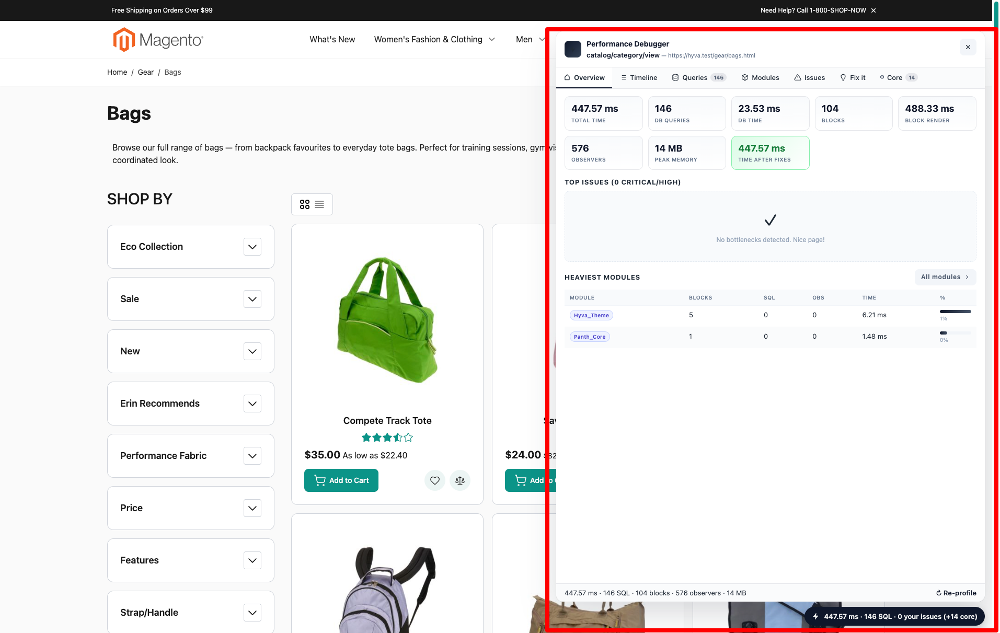
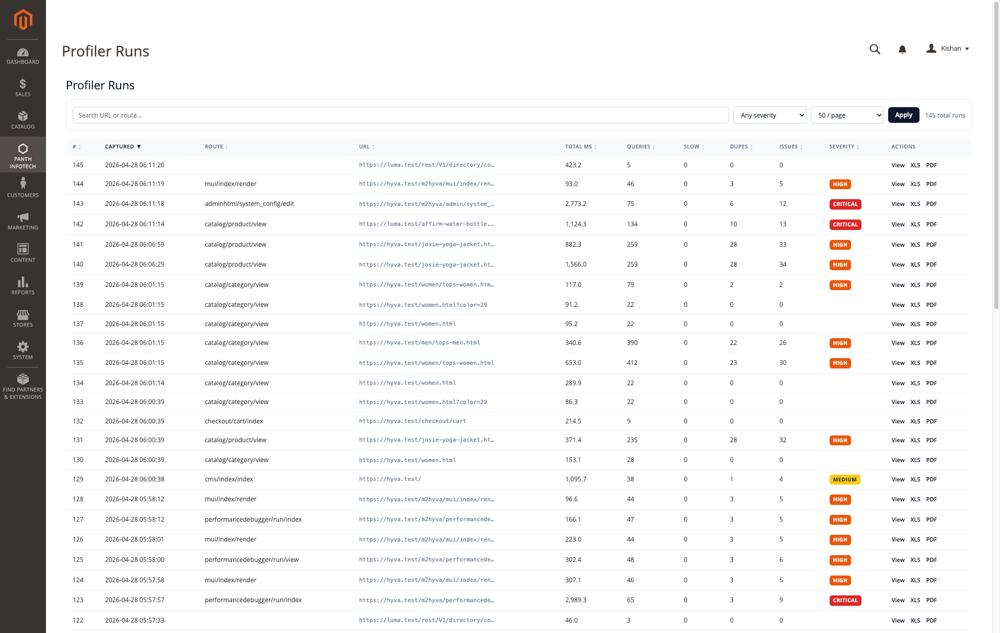

# Magento 2 Performance Debugger

Performance Debugger is a request profiler for Magento 2. When it is enabled, it profiles only requests that carry a profiling session started by an admin user (a signed cookie) or that come from an allowed IP address. For those requests it starts a timer at `Magento\Framework\App\Http::launch`, records the duration of every block render, event dispatch, layout generation step, controller dispatch and database query in the request, then analyses the recorded events for slow queries, duplicate or N+1 queries, slow blocks, slow observers and heavy modules. The results are shown in a floating toolbar on the storefront and, optionally, stored in the database so they can be reviewed later in the admin under a "Profiler Runs" grid with XLS and PDF export.

The module changes no storefront behaviour of its own. It adds interception plugins on core framework classes (blocks, event manager, layout, DB logger, front controller, HTTP application and response) that only measure and return the original result. It is aimed at developers and agencies who need per-request timing data for a Magento store. The storefront toolbar is self-contained inline HTML, CSS and JavaScript with no dependency on RequireJS, jQuery, Knockout or Alpine.js, so it works on Luma-based and Hyva themes.

Product page: [Magento 2 Performance Debugger](https://kishansavaliya.com/magento-2-performance-debugger.html)

## Features

- Records per-request events of the kinds `controller`, `layout`, `block`, `observer` and `query`, each with duration in milliseconds, a label, a source and optional metadata (template, class, output bytes, SQL fingerprint, redacted bind values, call site).
- Total wall-clock time from the start of `Http::launch` and peak memory of the request; when "Track Memory Per Event" is on, the memory usage at the moment each event is recorded.
- Database queries are captured through a plugin on `Magento\Framework\DB\LoggerInterface`. Each query gets a normalised fingerprint (numbers and string literals replaced, `IN (...)` lists collapsed) so repeated queries are grouped even when their bound values differ, plus a call trail of up to 5 non-framework frames taken from `debug_backtrace`. Quoted string literals in the recorded SQL are replaced with `'?'`, and bind values that are not numbers are replaced with `[string:<length>]`, so customer data, password hashes and tokens are not stored or shown.
- Bottleneck analysis (`Service\BottleneckAnalyzer`) produces findings of the kinds `duplicate_query` (flagged as "N+1 query" when the SQL looks like a single-row lookup), `slow_query`, `slow_block`, `slow_observer` and `heavy_module` (a module accumulating 100 ms or more). Each finding has a severity (`low`, `medium`, `high`, `critical`), an explanation, a suggested fix and an estimated saving computed from fixed factors per kind.
- Findings and module breakdowns are split into "userland" (app/code, app/design, non-Magento vendor packages) and Magento core (`vendor/magento/*`); core findings are shown separately as informational.
- Storefront toolbar with the tabs "Overview", "Timeline", "Queries", "Modules", "Issues", "Fix it" and "Core", text filters on the tables, copy buttons for SQL and fix snippets, a "Re-profile" link that reloads the page and Escape to close the panel.
- The toolbar layout handle is added only for requests that will actually show the toolbar, so pages served to normal visitors remain full-page-cacheable.
- Runs are persisted after the response has been sent into the tables `panth_perf_run` and `panth_perf_run_event`; the number of events per run is capped by "Max Events Per Run".
- Admin "Profiler Runs" grid with server-side paging (25, 50, 100 or 250 rows), sortable columns, a URL/route text search and a minimum severity filter; a run detail page with metric cards, the bottleneck list, the Magento core findings and the event list.
- Export of a run as an XLS file (Excel 2003 XML generated with `Magento\Framework\Convert\Excel`, columns Kind, Label, Source, Duration (ms), Invocations) and as a print-ready HTML report that opens the browser print dialog for saving as PDF.
- Hourly cleanup cron job and a console command that delete runs older than the configured retention.
- Opt-in capture: a request is profiled only when the browser has a profiling session started from the admin "Profiler Runs" page (a cookie holding an expiry time and an HMAC signature made with the Magento encryption key) or when the client IP is in "Allowed IP Addresses". Other visitors are never recorded. While a browser is being profiled, Magento's page cache serves it a separate, uncached variant (an `X-Magento-Vary` context value), so the toolbar and capture work on every storefront page; other visitors keep getting the cached pages. After the session cookie is stored, the toolbar removes the `panth_perf` token from the address bar.
- Store-view scoped configuration with per-collector switches, adjustable thresholds, an IP allow-list for recording and a session lifetime.

## Compatibility

| Platform | Versions |
|---|---|
| Magento Open Source | 2.4.4, 2.4.5, 2.4.6, 2.4.7, 2.4.8 |
| Adobe Commerce | 2.4.4, 2.4.5, 2.4.6, 2.4.7, 2.4.8 |
| PHP | 8.1, 8.2, 8.3, 8.4 |

Composer constraints from `composer.json`: `magento/framework` ^103.0, `magento/module-backend` ^102.0, `magento/module-config` ^101.2, `magento/module-store` ^101.1.

## Requirements

- Magento Open Source or Adobe Commerce 2.4.4 to 2.4.8.
- PHP `~8.1.0 || ~8.2.0 || ~8.3.0 || ~8.4.0`.
- `mage2kishan/module-core` ^1.0 (module `Panth_Core`). It provides the "Panth Extensions" admin menu group and configuration tab this module attaches to, and this module registers itself with `Panth\Core\ViewModel\ThemeConfig`.
- Magento cron must be running for the automatic cleanup of stored runs.

## Installation

```bash
composer require mage2kishan/module-performance-debugger
bin/magento module:enable Panth_Core Panth_PerformanceDebugger
bin/magento setup:upgrade
bin/magento setup:di:compile
bin/magento cache:flush
```

`setup:di:compile` is only required when the store runs in production mode. The module ships no files under `view/*/web`, so no static content deployment is needed.

Check that the module is enabled:

```bash
bin/magento module:status Panth_PerformanceDebugger
```

## Configuration

Admin path: Stores > Configuration > Panth Extensions > Performance Debugger. The same section is linked from the admin menu under Panth Extensions > Performance Debugger > Configuration. All settings can be set at default, website and store view scope; the code reads them at store view scope.

The profiler is off by default. Nothing is recorded, shown or stored until "Enable Profiler" is set to Yes. Even then, only requests with a profiling session or from an allowed IP address are recorded (see "Usage").

### General

| Setting | Default | What it does |
|---|---|---|
| Enable Profiler | No | Master switch. When disabled the profiler does not record anything. When enabled, only requests with a profiling session or from an allowed IP address are recorded. |
| Show Frontend Toolbar | Yes | Renders the floating panel on recorded storefront requests of a browser that has a profiling session started from the admin. With "Show Toolbar to Allowed IPs" = Yes it is also shown to allowed IPs. Shown only when "Enable Profiler" is Yes. |
| Allowed IP Addresses | `127.0.0.1` | Comma-separated list of IPv4 or IPv6 client addresses whose requests are always recorded, without a profiling session. Entries that are not a valid IP address or `*` are rejected when the configuration is saved. The client IP is `REMOTE_ADDR`; `X-Forwarded-For` and similar headers are used only if Magento's `RemoteAddress` has been configured with alternative headers. The value `*` records every visitor, but it is ignored in production mode. Shown only when "Enable Profiler" is Yes. |
| Profiling Session Lifetime (hours) | 4 | How long a profiling session started from the "Profiler Runs" page stays valid, 1 to 168 hours. |
| Show Toolbar to Allowed IPs | No | Yes shows the toolbar on recorded requests to clients in "Allowed IP Addresses" (in developer mode also to loopback and private-network clients) without a profiling session, as earlier versions did. No shows it only to browsers with a profiling session. |
| Production-Safe Mode | No | Forces the "Track Plugins" and "Track DI Resolution" settings off. Because those collectors are not implemented, this setting currently has no runtime effect. Shown only when "Enable Profiler" is Yes. |

Config paths: `performance_debugger/general/enabled`, `performance_debugger/general/show_toolbar`, `performance_debugger/general/allowed_ips`, `performance_debugger/general/session_lifetime`, `performance_debugger/general/toolbar_ip_access`, `performance_debugger/general/safe_mode`.

### Collectors

| Setting | Default | What it does |
|---|---|---|
| Track Block Rendering | Yes | Times every `AbstractBlock::toHtml()` call (except the module's own blocks) and records template, class and output size. |
| Track Observers | Yes | Times every `EventManager::dispatch()` call, recorded by event name. |
| Track Plugins | Yes | Not implemented. The setting is read by `Helper\Config::trackPlugins()`, but no collector records `plugin` events, so it has no effect. |
| Track DB Queries | Yes | Times every query logged through `Magento\Framework\DB\LoggerInterface` and captures the SQL (string literals redacted), numeric bind values (other values redacted) and call trail. |
| Track Layout XML | Yes | Times `Layout::generateXml()` and `Layout::generateElements()` and records the layout handles. |
| Track DI Resolution | No | Not implemented. No collector records `di` events, so it has no effect. |
| Track Memory Per Event | Yes | Stores `memory_get_usage(true)` with every recorded event. |

Config paths: `performance_debugger/collectors/track_blocks`, `track_observers`, `track_plugins`, `track_db`, `track_layout`, `track_di`, `track_memory`.

### Thresholds

| Setting | Default | What it does |
|---|---|---|
| Slow Query (ms) | 50 | Queries at or above this duration are flagged as slow. |
| Slow Block Render (ms) | 50 | Blocks at or above this render time are flagged. |
| Slow Observer (ms) | 30 | Event dispatches at or above this duration are flagged. |
| Slow Plugin (ms) | 20 | Read by `Helper\Config::slowPluginMs()`; not used by the analyzer because no plugin events are recorded. |
| Duplicate Query Threshold | 3 | The same SQL fingerprint repeated at least this many times in one request produces a duplicate or N+1 finding. |

Severity for slow findings is derived from the threshold: `medium` at 2x, `high` at 4x and `critical` at 8x the threshold; anything below 2x is `low`.

Config paths: `performance_debugger/thresholds/slow_query_ms`, `slow_block_ms`, `slow_observer_ms`, `slow_plugin_ms`, `duplicate_query_threshold`.

### Storage

| Setting | Default | What it does |
|---|---|---|
| Persist Profiler Runs | Yes | Saves each run to the database after the response is sent so it appears in the "Profiler Runs" grid. |
| Retention (hours) | 24 | The cleanup cron job and console command delete runs whose `created_at` is older than this many hours. Cleanup runs whether or not "Persist Profiler Runs" is enabled, so runs stored earlier are still removed. |
| Max Events Per Run | 5000 | Hard cap on recorded events per request; events beyond the cap are dropped. |

Config paths: `performance_debugger/storage/persist_runs`, `performance_debugger/storage/retention_hours`, `performance_debugger/storage/max_events_per_run`.

### Reports

| Setting | Default | What it does |
|---|---|---|
| Enable Excel (XLS) Export | Yes | Enables the "XLS" export action, which downloads an Excel 2003 XML spreadsheet saved as `.xls` in the grid and detail page. When disabled the controller redirects back to the grid with an error message. |
| Enable PDF Export | Yes | Enables the "PDF" export action. When disabled the controller redirects back to the grid with an error message. |

Config paths: `performance_debugger/export/enable_xls`, `performance_debugger/export/enable_pdf`.

### Production use

The module is designed to be enabled temporarily. With "Enable Profiler" = Yes, ordinary visitors are not recorded: capture needs a profiling session started by an admin user with the "Profiler Runs" permission, or a client IP listed in "Allowed IP Addresses". While a request is not being profiled every collector plugin returns on its first line after checking an in-memory flag, and the block and event collectors are before/after plugins, so there is no around-plugin chain on those hot paths. "Production-Safe Mode" currently has no runtime effect because it only switches off two collectors that are not implemented. Keep the profiler disabled on a live store except during a profiling session, and keep "Allowed IP Addresses" limited to your own addresses.

## Usage

### Storefront toolbar

1. Set "Enable Profiler" to Yes and keep "Show Frontend Toolbar" at Yes.
2. In the admin open Panth Extensions > Performance Debugger > Profiler Runs and click "Start: <store view>". The admin controller `performancedebugger/run/session` (ACL `Panth_PerformanceDebugger::runs`) redirects to the store view's home page with `?panth_perf=<expiry>.<signature>`. The storefront checks the signature, stores it in the HttpOnly cookie `panth_perf` for the "Profiling Session Lifetime" and profiles this and every later request of that browser until the session expires. "Stop: <store view>" opens the store view with `?panth_perf=0`, which deletes the cookie. Requests that carry the `panth_perf` parameter are never stored in the full page cache.
3. Load any storefront page in that browser. The observer `Observer\AddToolbarLayoutHandle` adds the layout handle `panth_performance_debugger_toolbar`, which inserts the block `panth.performance.debugger.toolbar` (marked `cacheable="false"`) into the `before.body.end` container.

The toolbar opens a panel with the request URL, route, total time, peak memory and the following tabs:

- "Overview": summary counts, the userland findings and the userland module breakdown.
- "Timeline": every recorded event in order, with kind, label, origin, module and duration; filterable.
- "Queries": every query with its duration, SQL and call origin; filterable, with a copy button for the SQL.
- "Modules": time per module, split into your modules and Magento core.
- "Issues": userland findings with severity, measured time, estimated saving, call sites and distinct bind values.
- "Fix it": the suggested fix and a copyable code snippet for each finding kind.
- "Core": findings that originate in `vendor/magento/*`, shown for information only.

The screenshots under `docs/images/` show the toolbar and admin screens: `toolbar-overview.png`, `toolbar-timeline.png`, `toolbar-queries.png`, `toolbar-modules.png`, `toolbar-core.png`, `admin-runs-grid.png`, `admin-run-detail.png`, `admin-configuration.png`, `pdf-report-top.png`, `pdf-report-bottom.png` and `admin-dashboard-demo.gif`.



### Admin report

With "Persist Profiler Runs" enabled, every profiled request that produced at least one event is stored after the response has been sent (`Plugin\ResponseFinalizePlugin`, plugin on `Magento\Framework\App\ResponseInterface::sendResponse`). The run records the real area code (for example `frontend` or `adminhtml`) and the HTTP status code of the response. Values of query parameters whose names look sensitive (for example containing `pass`, `token`, `key`, `code`, `hash`, `sid`, `email`, and the `panth_perf` session parameter) and path parameters such as `/key/<value>/` are replaced with `***` in the stored URL. Persistence errors are caught and never affect the response.

Open Panth Extensions > Performance Debugger > Profiler Runs in the admin (route `performancedebugger/run/index`). The grid shows the run id, capture time, route, URL, total ms, query count, slow and duplicate query counts, issue count and maximum severity, and offers "View", "XLS" and "PDF" actions per row. The detail page (`performancedebugger/run/view`) shows the metric cards, "Your bottlenecks" and "Magento core findings" sections and the stored events.



- XLS export (`performancedebugger/run/exportXls`) downloads `panth_perf_run_<id>.xls` with one row per stored event.
- PDF export (`performancedebugger/run/exportPdf`) opens an HTML report in a new tab that calls `window.print()` automatically; use the browser's "Save as PDF". The report contains summary cards, the bottleneck cards with call sites, bind values and fix snippets, the heaviest modules and the first 200 events.

### Cron job

| Job | Schedule | Class | What it does |
|---|---|---|---|
| `panth_perf_cleanup` | `0 * * * *` (hourly) | `Cron\CleanupRuns` | Deletes rows from `panth_perf_run` older than "Retention (hours)"; events are removed by the foreign key `ON DELETE CASCADE`. Runs regardless of the "Persist Profiler Runs" setting. |

### Console command

```bash
bin/magento panth:perf:cleanup
```

Runs the same cleanup as the cron job immediately and prints "Profiler runs older than retention have been removed."

### Data retention and logging

Runs live in the database only. They are removed by the hourly cron job or the console command once older than "Retention (hours)". The module writes no log files. On upgrade, the data patch `Setup\Patch\Data\RedactStoredRuns` applies the current redaction once to runs stored by earlier versions: the stored URL is masked, quoted literals are removed from recorded SQL, fingerprints and findings, and string bind values are replaced with `[string:<length>]`.

## Developer Notes

- Module name: `Panth_PerformanceDebugger`
- Composer package: `mage2kishan/module-performance-debugger`
- PHP namespace: `Panth\PerformanceDebugger`
- Sequence: loads after `Panth_Core`, `Magento_Backend`, `Magento_Config` and `Magento_Store`.

Key classes and extension points:

- `Service\Profiler` (shared instance): `start()`, `isActive()`, `getToken()`, `record(string $kind, string $label, float $duration, array $meta = [], ?string $source = null)`, `getEvents()`, `getAggregates()`, `getDuplicateQueries()`, `totalElapsedMs()`, `getRequestContext()`, `reset()`. Call `record()` from your own code to add custom events to a run.
- `Service\BottleneckAnalyzer`: `analyze(Profiler $profiler)`, `severityWeight()`, `totalEstimatedSavings()`, `userlandFrame()`, `isCoreFinding()`.
- `Service\CaptureGate`: decides whether a request is profiled (`shouldCapture()`), whether the toolbar may be shown (`canViewToolbar()`), and creates and checks profiling session tokens (`createToken()`, `isValidToken()`).
- `Service\Redactor`: `sanitizeUrl()`, `redactSql()`, `safeBind()`; used when recording and by the redaction data patch.
- `Helper\Config`: typed accessors for every setting (`isEnabled()`, `showToolbar()`, `safeMode()`, `allowedIps()`, `isClientAllowed()`, `toolbarForAllowedIps()`, `sessionLifetimeHours()`, `trackBlocks()`, ..., `retentionHours()`, `maxEventsPerRun()`, `enableXls()`, `enablePdf()`).
- Collectors, declared in `etc/di.xml`: `Plugin\HttpAppPlugin` (before `App\Http::launch`), `Plugin\FrontControllerPlugin` (around `FrontControllerInterface::dispatch`), `Plugin\BlockPlugin` (before and after `AbstractBlock::toHtml`), `Plugin\EventManagerPlugin` (before and after `Event\ManagerInterface::dispatch`), `Plugin\LayoutPlugin` (around `LayoutInterface::generateXml` and `generateElements`), `Plugin\DbLoggerPlugin` (after `DB\LoggerInterface::startTimer` and `logStats`), `Plugin\ResponseFinalizePlugin` (after `ResponseInterface::sendResponse`, sort order 100).
- `Observer\AddToolbarLayoutHandle` on `layout_load_before` (frontend area only).
- `Block\Toolbar` (`shouldRender()`, `getPayload()`, `getPayloadJson()`) and template `view/frontend/templates/toolbar.phtml`; the payload is embedded as JSON in the `data-pdbg-payload` attribute.
- `Model\RunPersister::persist(Profiler $profiler, ?int $statusCode = null)` and `Model\RunRepository` (`getRecent()`, `getPaged()`, `getById()`, `getByToken()`, `getEvents()`). The persister writes the current area code and the response status code into the `area` and `status_code` columns.
- Admin controllers under `Controller\Adminhtml\Run`: `Index`, `View`, `ExportXls`, `ExportPdf`, `Session` (starts or stops a storefront profiling session) (admin route front name `performancedebugger`).
- Console command `Console\Command\CleanupCommand` (`panth:perf:cleanup`), registered in `etc/di.xml`.
- `etc/frontend/di.xml` adds `Panth_PerformanceDebugger` to the `registeredModules` argument of `Panth\Core\ViewModel\ThemeConfig`.

ACL resources (`etc/acl.xml`):

- `Panth_PerformanceDebugger::root` ("Performance Debugger")
- `Panth_PerformanceDebugger::runs` ("Profiler Runs"): grid, detail page and starting a storefront profiling session
- `Panth_PerformanceDebugger::export` ("Export Reports"): XLS and PDF export
- `Panth_PerformanceDebugger::config` ("Performance Debugger Configuration"): configuration section and menu group

Database tables (`etc/db_schema.xml`, whitelisted in `etc/db_schema_whitelist.json`):

- `panth_perf_run`: one row per profiled request (`run_id`, `token`, `url`, `route`, `method`, `status_code`, `area`, `store_id`, `total_time`, `db_time`, `db_queries`, `db_slow`, `db_duplicates`, `block_time`, `block_count`, `observer_time`, `observer_count`, `plugin_time`, `plugin_count`, `memory_peak`, `bottleneck_count`, `severity_max`, `summary` JSON, `created_at`).
- `panth_perf_run_event`: one row per recorded event (`event_id`, `run_id`, `kind`, `label`, `source`, `duration`, `memory_delta`, `invocations`, `severity`, `meta` JSON), foreign key to `panth_perf_run` with cascade delete.

## Uninstallation

```bash
bin/magento module:disable Panth_PerformanceDebugger
composer remove mage2kishan/module-performance-debugger
bin/magento setup:upgrade
bin/magento setup:di:compile
bin/magento cache:flush
```

Disabling the module leaves the tables `panth_perf_run` and `panth_perf_run_event` and the configuration values under `performance_debugger/*` in `core_config_data` in place; drop or delete them manually if you want a clean database. The module writes no log files.

## Support

- Product page: [Magento 2 Performance Debugger](https://kishansavaliya.com/magento-2-performance-debugger.html)
- Contact: [kishansavaliya.com/contact](https://kishansavaliya.com/contact)
- Email: kishansavaliyakb@gmail.com
- Issues: [GitHub issues](https://github.com/mage2sk/module-performance-debugger/issues)

## License

Proprietary, as declared in `composer.json`. The package is published on Packagist and can be installed with Composer; see the product page for the terms of use.

## Changelog

See [CHANGELOG.md](CHANGELOG.md).

## Links

- Website: [kishansavaliya.com](https://kishansavaliya.com)
- All extensions: [Magento extensions catalogue](https://kishansavaliya.com/magento-extensions.html)
- GitHub: [mage2sk/module-performance-debugger](https://github.com/mage2sk/module-performance-debugger)
- Packagist: [mage2kishan/module-performance-debugger](https://packagist.org/packages/mage2kishan/module-performance-debugger)
